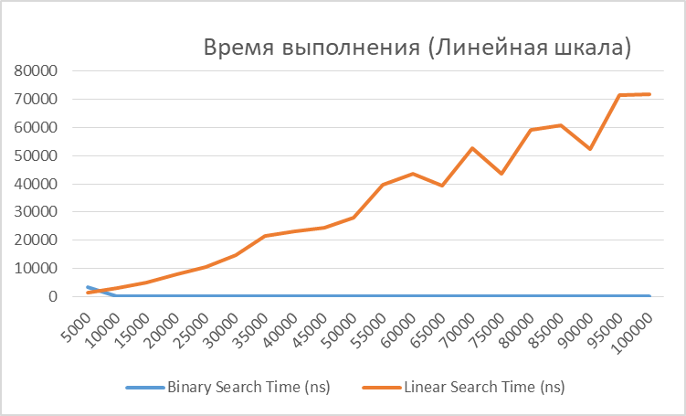
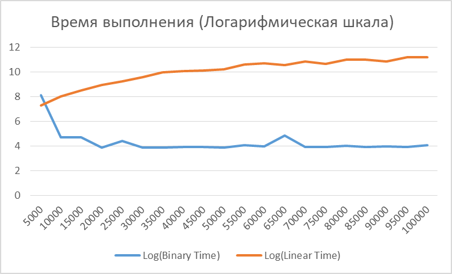

# Отчет по лабораторной работе 1. Введение в алгоритмы. Сложность. Поиск

**Дата:** 2025-10-10

**Семестр:** 3 курс 5 семестр

**Группа:** ПИЖ-б-о-23-2(1)

**Дисциплина:** Анализ сложности алгоритмов

**Студент:** Цапаев Данил Денисович

## Цель работы

Освоить понятие вычислительной сложности алгоритма.
Получить практические навыки реализации и анализа линейного и бинарного поиска.
Научиться экспериментально подтверждать теоретические оценки сложности O(n) и O(log n)

## Практическая часть

### Выполненные задачи

- [ ] Задача 1: Реализовать функцию линейного поиска элемента в массиве.
- [ ] Задача 2: Реализовать функцию бинарного поиска элемента в отсортированном массиве.
- [ ] Задача 3: Провести теоретический анализ сложности обоих алгоритмов.
- [ ] Задача 4: Экспериментально сравнить время выполнения алгоритмов на массивах разного размера.
- [ ] Задача 5: Визуализировать результаты, подтвердив асимптотику O(n) и O(log n).

### Ключевые фрагменты кода

```KOTLIN

// main.kt

/**
 * Линейный поиск элемента в массиве.
 * @param array Массив для поиска
 * @param target Искомый элемент
 * @return Индекс найденного элемента или -1 если элемент не найден
 *
 * Алгоритмическая сложность: O(n) в худшем случае
 */
fun linearSearch(array: Array<Int>, target: Int): Int {
    if (array.isNotEmpty()) {                               // O(1) - проверка условия
        for (i in array.indices) {                          // O(n) - цикл выполняется n раз
            if (array[i] == target) return i                // O(1) - проверка условия, сравнение и возврат значения
        }
    }
    return -1                                               // O(1) - возврат значения

    // O(1) + O(n) * O(1) + O(1) = O(n)
}

/**
 * Бинарный поиск элемента в ОТСОРТИРОВАННОМ массиве.
 * @param array ОТСОРТИРОВАННЫЙ массив для поиска
 * @param target Искомый элемент
 * @return Индекс найденного элемента или -1 если элемент не найден
 *
 * Алгоритмическая сложность: O(log n)
 */
fun binarySearch(array: Array<Int>, target: Int): Int {
    var left = 0                                            // O(1) - инициализация переменной
    var right: Int = array.lastIndex                        // O(1) - получение lastIndex + инициализация

    if (array.isNotEmpty()) {                               // O(1) - проверка условия
        while (left <= right) {                             // O(log n) - цикл выполняется log₂(n) раз
            val mid = left + (right - left) / 2             // O(1) - вычисление среднего индекса
            when {                                          // O(1) - оператор выбора
                target == array[mid] -> return mid          // O(1) - сравнение + возврат
                target > array[mid] -> left = mid + 1       // O(1) - сравнение + присваивание
                else -> right = mid - 1                     // O(1) - присваивание
            }
        }
    }
    return -1                                               // O(1) - возврат значения

    // O(1) + O(1) + O(1) + [O(log n) × (O(1) + O(1))] + O(1) = O(log n)
}

/**
 * Измеряет среднее время выполнения функции поиска для конкретного массива и цели.
 * @param times Количество повторений для усреднения
 * @param searchFunction Функция поиска, время которой измеряется
 * @param array Массив для поиска
 * @param target Целевой элемент для поиска
 * @return Средняя продолжительность выполнения функции за times выполнений
 */
fun measureAverageTime(
    times: Int,
    searchFunction: (Array<Int>, Int) -> Int,
    array: Array<Int>,
    target: Int
): Duration {
    repeat(10000) {
        searchFunction(array, target)
    }

    var totalTime: Duration = Duration.ZERO

    repeat(times) {
        totalTime += measureTime { searchFunction(array, target) }
    }

    return totalTime / times
}

/**
 * Генерирует отсортированный массив заданного размера
 * @param size Размер массива
 * @return Отсортированный массив случайных чисел
 */
fun generateSortedArray(size: Int): Array<Int> {
    return Array(size) { Random.nextInt(0, size * 10) }.sortedArray()
}

/**
 * Тестирует алгоритмы поиска на массивах разного размера
 * @param sizes Список размеров массивов для тестирования
 * @param testsPerSize Количество тестов для каждого размера
 * @return Пару списков, содержащих времена замеров
 */
fun runSearchBenchmark(sizes: List<Int>, testsPerSize: Int): Pair<List<Double>, List<Double>> {
    println("Размер массива | Бинарный поиск | Линейный поиск | Ускорение")
    println("---------------|----------------|----------------|----------")

    val binaryTimes = mutableListOf<Double>()
    val linearTimes = mutableListOf<Double>()

    for (size in sizes) {
        // Генерируем отсортированный массив
        val array = generateSortedArray(size)

        // Тестируем разные сценарии поиска
        val testTargets = listOf(
            array.first(),                          // Первый элемент (лучший случай для линейного)
            array.last(),                           // Последний элемент (худший случай для линейного)
            array[size / 2],                        // Средний элемент
            -1,                                     // Отсутствующий элемент (худший случай для обоих)
            array[Random.nextInt(size)]             // Случайный элемент
        )

        var totalBinaryTime = Duration.ZERO
        var totalLinearTime = Duration.ZERO

        for (target in testTargets) {
            totalBinaryTime += measureAverageTime(testsPerSize, ::binarySearch, array, target)
            totalLinearTime += measureAverageTime(testsPerSize, ::linearSearch, array, target)
        }

        // Усредняем по всем тестовым целям
        val avgBinaryTime = totalBinaryTime / testTargets.size
        val avgLinearTime = totalLinearTime / testTargets.size

        binaryTimes.add(avgBinaryTime.inWholeNanoseconds.toDouble())
        linearTimes.add(avgLinearTime.inWholeNanoseconds.toDouble())

        val speedup = avgLinearTime / avgBinaryTime

        println(
            "%13d | %14.6f mcs | %14.6f mcs | %8.2fx".format(
                size,
                avgBinaryTime.inWholeMicroseconds.toDouble(),
                avgLinearTime.inWholeMicroseconds.toDouble(),
                speedup
            )
        )
    }

    // Выводим данные для построения графиков
    println("\nДанные для построения графиков:")
    println("Sizes: ${sizes.joinToString()}")
    println("Binary: [${binaryTimes.joinToString { "%.6f".format(it / 1_000_000) }}]") // в миллисекундах
    println("Linear: [${linearTimes.joinToString { "%.6f".format(it / 1_000_000) }}]") // в миллисекундах

    return Pair(binaryTimes, linearTimes)
}

/**
 * Создает CSV файл для линейного графика.
 * @param sizes Массив размеров массивов для поиска
 * @param binaryTimes Массив замеров времени для бинарного поиска
 * @param linearTimes Массив замеров времени для линейного поиска
 * @param filename Название выходного файла
 */
fun createLinearChartCSV(
    sizes: List<Int>,
    binaryTimes: List<Double>,
    linearTimes: List<Double>,
    filename: String
) {
    val file = File(filename)
    val writer = FileWriter(file)

    try {
        writer.write("Array Size\tBinary Search Time (ns)\tLinear Search Time (ns)\tSpeedup Factor\n")
        for (i in sizes.indices) {
            val size = sizes[i]
            val binaryTime = binaryTimes[i]
            val linearTime = linearTimes[i]
            val speedup = linearTime / binaryTime

            writer.write(
                "$size\t%.6f\t%.6f\t%.2f\n".format(
                    binaryTime, linearTime, speedup
                )
            )
        }

        println("Файл для линейного графика создан: $filename")

    } finally {
        writer.close()
    }
}

/**
 * Создает CSV файл для log-log графика.
 * @param sizes Массив размеров массивов для поиска
 * @param binaryTimes Массив замеров времени для бинарного поиска
 * @param linearTimes Массив замеров времени для линейного поиска
 * @param filename Название выходного файла
 */
fun createLogLogChartCSV(
    sizes: List<Int>,
    binaryTimes: List<Double>,
    linearTimes: List<Double>,
    filename: String
) {
    val file = File(filename)
    val writer = FileWriter(file)

    try {
        writer.write("Array Size\tLog(Array Size)\tBinary Search Time (ns)\tLog(Binary Time)\tLinear Search Time (ns)\tLog(Linear Time)\n")
        for (i in sizes.indices) {
            val size = sizes[i]
            val logSize = ln(size.toDouble())
            val binaryTime = binaryTimes[i]
            val logBinaryTime = ln(binaryTime)
            val linearTime = linearTimes[i]
            val logLinearTime = ln(linearTime)

            writer.write(
                "$size\t%.6f\t%.6f\t%.6f\t%.6f\t%.6f\n".format(
                    logSize, binaryTime, logBinaryTime, linearTime, logLinearTime
                )
            )
        }

        println("Файл для log-log графика создан: $filename")

    } finally {
        writer.close()
    }
}

fun main() {

    // Размеры массивов для тестирования
    val sizes = (1..20).map { it * 5000 }
    val testsPerSize = 50
    println("=== СРАВНЕНИЕ АЛГОРИТМОВ ПОИСКА ===")
    println("Количество тестов на размер: $testsPerSize")
    println("Размеры массивов: ${sizes.joinToString()}")
    println()

    val (binaryTimes, linearTimes) = runSearchBenchmark(sizes, testsPerSize)

    // Дополнительный анализ для маленьких массивов
    println("\n=== АНАЛИЗ ДЛЯ МАЛЕНЬКИХ МАССИВОВ ===")
    val smallSizes = listOf(10, 20, 50, 100, 200, 500, 1000)
    runSearchBenchmark(smallSizes, testsPerSize)

    // Создаем директорию для csv-файлов
    val resultsDir = File("search_charts")
    resultsDir.mkdirs()
    // Создаем файлы данных
    createLinearChartCSV(
        sizes, binaryTimes, linearTimes,
        "search_charts/linear_chart_data.csv"
    )

    createLogLogChartCSV(
        sizes, binaryTimes, linearTimes,
        "search_charts/log_log_chart_data.csv"
    )
}
```

```bash
Характеристики ПК для тестирования:
Процессор:          AMD Ryzen 7 5800H with Radeon Graphics 3.20 GHz
ОЗУ:                16,0 ГБ
ОС:                 Windows 11 (x64)
```

## Результаты

Пример вывода:

```bash
=== СРАВНЕНИЕ АЛГОРИТМОВ ПОИСКА ===
Количество тестов на размер: 50
Размеры массивов: 5000, 10000, 15000, 20000, 25000, 30000, 35000, 40000, 45000, 50000, 55000, 60000, 65000, 70000, 75000, 80000, 85000, 90000, 95000, 100000

Размер массива | Бинарный поиск | Линейный поиск | Ускорение
---------------|----------------|----------------|----------

         5000 |       3,000000 mcs |       1,000000 mcs |     0,44x
        10000 |       0,000000 mcs |       3,000000 mcs |    27,60x
        15000 |       0,000000 mcs |       5,000000 mcs |    45,48x
        20000 |       0,000000 mcs |       7,000000 mcs |   163,46x
        25000 |       0,000000 mcs |      10,000000 mcs |   123,42x
        30000 |       0,000000 mcs |      14,000000 mcs |   304,31x
        35000 |       0,000000 mcs |      21,000000 mcs |   451,50x
        40000 |       0,000000 mcs |      23,000000 mcs |   446,44x
        45000 |       0,000000 mcs |      24,000000 mcs |   477,98x
        50000 |       0,000000 mcs |      27,000000 mcs |   580,85x
        55000 |       0,000000 mcs |      39,000000 mcs |   681,95x
        60000 |       0,000000 mcs |      43,000000 mcs |   792,16x
        65000 |       0,000000 mcs |      39,000000 mcs |   307,65x
        70000 |       0,000000 mcs |      52,000000 mcs |  1016,29x
        75000 |       0,000000 mcs |      43,000000 mcs |   869,92x
        80000 |       0,000000 mcs |      59,000000 mcs |  1059,82x
        85000 |       0,000000 mcs |      60,000000 mcs |  1167,19x
        90000 |       0,000000 mcs |      52,000000 mcs |   949,98x
        95000 |       0,000000 mcs |      71,000000 mcs |  1377,46x
       100000 |       0,000000 mcs |      71,000000 mcs |  1236,28x

Данные для построения графиков:
Sizes: 5000, 10000, 15000, 20000, 25000, 30000, 35000, 40000, 45000, 50000, 55000, 60000, 65000, 70000, 75000, 80000, 85000, 90000, 95000, 100000
Binary: [0,003391, 0,000109, 0,000112, 0,000048, 0,000084, 0,000048, 0,000048, 0,000052, 0,000051, 0,000048, 0,000058, 0,000055, 0,000128, 0,000052, 0,000050, 0,000056, 0,000052, 0,000055, 0,000052, 0,000058]
Linear: [0,001486, 0,003008, 0,005094, 0,007846, 0,010367, 0,014607, 0,021672, 0,023215, 0,024377, 0,027881, 0,039553, 0,043569, 0,039379, 0,052847, 0,043496, 0,059350, 0,060694, 0,052249, 0,071628, 0,071704]

=== АНАЛИЗ ДЛЯ МАЛЕНЬКИХ МАССИВОВ ===

Размер массива | Бинарный поиск | Линейный поиск | Ускорение
---------------|----------------|----------------|----------
           10 |       0,000000 mcs |       0,000000 mcs |     0,89x
           20 |       0,000000 mcs |       0,000000 mcs |     1,03x
           50 |       0,000000 mcs |       0,000000 mcs |     1,15x
          100 |       0,000000 mcs |       0,000000 mcs |     1,61x
          200 |       0,000000 mcs |       0,000000 mcs |     2,37x
          500 |       0,000000 mcs |       0,000000 mcs |     4,29x
         1000 |       0,000000 mcs |       0,000000 mcs |     8,26x

Данные для построения графиков:
Sizes: 10, 20, 50, 100, 200, 500, 1000
Binary: [0,000038, 0,000035, 0,000040, 0,000036, 0,000038, 0,000041, 0,000039]
Linear: [0,000034, 0,000036, 0,000046, 0,000058, 0,000090, 0,000176, 0,000322]
Файл для линейного графика создан: search_charts/linear_chart_data.csv
Файл для log-log графика создан: search_charts/log_log_chart_data.csv
```



На первом графике можно наблюдать теоретически предсказуемый линейный рост времени выполнения алгоритма.
Присутствующие скачки могут обусловлены различными факторами (например, фоновые процессы, особенности работы JVM, на которой выполняется код). Однако, глобально на общую картину они не влияют. График бинарного поиска при этом, за исключением скачков, близится к константному, что так же теоретически ожидаемо, в виду его логарифмической природы.



Второй график демонстрирует более наглядное сравнение алгоритмов.
Как и ожидалось, график линейного алгоритма принимает вид, близкий к логарифмическому, что связано с приведением шкалы времени к логарифмическому масштабу.
График бинарного поиска принимает несколько аномальный вид. Значения времени выполнения с увеличением N снижаются и в определенный момент стабилизируются. Это так же может быть связано с особенностями работы JVM, кэшированием и оптимизациями, проводимыми ей. Однако, общая картина все равно достоверно отображает ускорение бинарного поиска относительно линейного, в чем и заключалась основная цель визуализации

## Ответы на контрольные вопросы

## 1. Что такое асимптотическая сложность алгоритма и зачем она нужна?

Асимптотическая сложность — это способ оценки эффективности алгоритма в зависимости от размера входных данных. Она показывает, как быстро растёт время выполнения (или объём памяти) при увеличении количества элементов.  
Нужна она для того, чтобы сравнивать алгоритмы независимо от конкретных компьютеров и измерять их производительность в общем виде, не проводя реальные тесты для всех возможных размеров данных.

---

## 2. Разница между O(1), O(n) и O(log n) с примерами

- **O(1)** — постоянное время: выполнение не зависит от размера данных.  
  Пример: доступ к элементу массива по индексу.
  
- **O(n)** — линейное время: время выполнения растёт прямо пропорционально количеству элементов.  
  Пример: линейный поиск элемента в неотсортированном массиве.
  
- **O(log n)** — логарифмическое время: время растёт медленно, при каждом шаге сокращается количество проверяемых данных.  
  Пример: бинарный поиск в отсортированном массиве.

---

## 3. Отличие линейного поиска от бинарного и условия выполнения бинарного поиска

- **Линейный поиск** проверяет элементы последовательно — от начала до конца. Сложность O(n).  
- **Бинарный поиск** делит отсортированный массив пополам, исключая половину элементов на каждом шаге. Сложность O(log n).  

**Условия для бинарного поиска:**

1. Массив должен быть **отсортирован**.
2. Должна быть возможность **доступа по индексу** к элементам.

---

## 4. Почему практическое время выполнения может отличаться от O-большого

Асимптотическая оценка показывает поведение при **больших n** и не учитывает:

- константные факторы (например, оптимизация компилятора или кэширование);
- различия в архитектуре процессора;
- влияние среды выполнения (операционная система, фоновая нагрузка);
- конкретные входные данные (лучший, худший, средний случаи).

Из-за этого реальное время может отличаться, особенно при малых размерах входа.

---

## 5. Как экспериментально подтвердить, что сложность равна O(n) или O(log n)

### План эксперимента

1. **Выбрать алгоритм** (например, линейный или бинарный поиск).  
2. **Сгенерировать тестовые данные** разных размеров: N = 100, 1000, 10000, 100000 и т.д.  
3. **Измерить время выполнения** алгоритма для каждого размера.  
4. **Построить график** зависимости времени от N.  
5. **Сравнить форму графика**:
   - Прямая линия → O(n)  
   - Кривая, растущая медленно (похожа на логарифм) → O(log n)  

---
