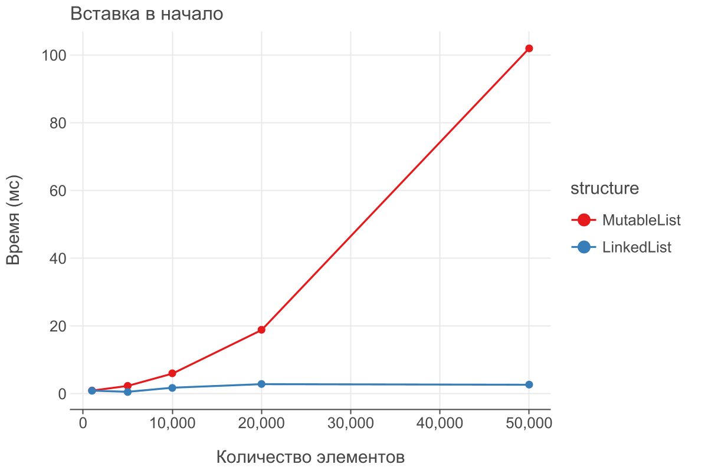
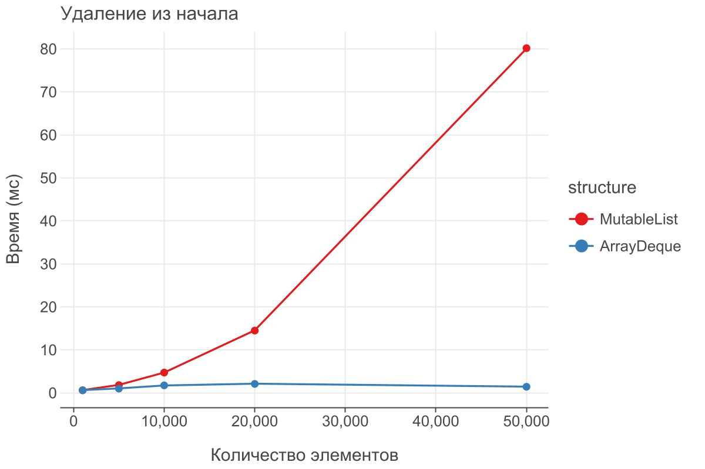

# Отчет по лабораторной работе 2. Основные структуры данных

**Дата:** 2025-22-10

**Семестр:** 3 курс 5 семестр

**Группа:** ПИЖ-б-о-23-2(1)

**Дисциплина:** Анализ сложности алгоритмов

**Студент:** Цапаев Данил Денисович

## Цель работы

Изучить понятие и особенности базовых абстрактных типов данных (стек, очередь, дек,
 связный список) и их реализаций в Python. Научиться выбирать оптимальную структуру данных для
 решения конкретной задачи, основываясь на анализе теоретической и практической сложности
 операций. Получить навыки измерения производительности и применения структур данных для
 решения практических задач.

## Практическая часть

### Выполненные задачи

- [ ] Задача 1: Реализовать класс LinkedList (связный список) для демонстрации принципов его работы.
- [ ] Задача 2: Используя встроенные типы данных (list, collections.deque), проанализировать
 эффективность операций, имитирующих поведение стека, очереди и дека.
- [ ] Задача 3: Провести сравнительный анализ производительности операций для разных структур данных
 (list vs LinkedList для вставки, list vs deque для очереди).
- [ ] Задача 4: Решить 2-3 практические задачи, выбрав оптимальную структуру данных.

### Ключевые фрагменты кода

```kotlin
// Main.kt

fun main() {
    println("Измерение производительности структур данных...")
    val results = measurePerformance()

    println("Создание графиков...")
    createCharts(results)

    printBenchmarkTable(results)

    println("Графики сохранены в файлы:")
    println("- performance_insertion.png")
    println("- performance_removal.png")
    println("\nАнализ завершен!")

}
```

```kotlin
// LinkedList.kt

class Node<T>(var data: T, var next: Node<T>? = null)

/**
 * Реализация односвязного списка.
 * @property head ссылка на первый элемент списка
 * @property tail ссылка на последний элемент списка
 */
class LinkedList<T> {
    private var head: Node<T>? = null
    private var tail: Node<T>? = null

    /**
     * Добавляет новый элемент в начало списка.
     * Временная сложность: O(1)
     * @param data данные для добавления
     */
    fun insertAtStart(data: T) {
        val newNode = Node(data, head)
        head = newNode
        if (tail == null) tail = head
    }

    /**
     * Добавляет новый элемент в конец списка.
     * Временная сложность: O(1), благодаря использованию tail.
     * @param data данные для добавления
     */
    fun insertAtEnd(data: T) {
        val newNode = Node(data)
        if (tail == null) {
            head = newNode
            tail = newNode
        } else {
            tail!!.next = newNode
            tail = newNode
        }
    }

    /**
     * Удаляет элемент из начала списка.
     * Временная сложность: O(1)
     * @return данные удаленного элемента или null, если список пуст
     */
    fun deleteFromStart(): T? {
        val value = head?.data
        head = head?.next
        if (head == null) tail = null
        return value
    }

    /**
     * Проходит по списку и возвращает все элементы в виде списка.
     * Временная сложность: O(n), где n — количество элементов в списке
     * @return список данных
     */
    fun traverse(): List<T> {
        val elements = mutableListOf<T>()
        var current = head
        while (current != null) {
            elements.add(current.data)
            current = current.next
        }
        return elements
    }
}
```

```kotlin
// PerformanceBenchmark.kt

/**
 * Класс, хранящий результаты измерения производительности операций.
 * @property operation название операции (например, "Вставка в начало")
 * @property dataStructure тип структуры данных (например, "MutableList")
 * @property elements количество обработанных элементов
 * @property timeNs время выполнения операции в наносекундах
 */
data class PerformanceResult(
    val operation: String,
    val dataStructure: String,
    val elements: Int,
    val timeNs: Double
)

/**
 * Выполняет измерение времени выполнения различных операций над коллекциями.
 * @return список результатов с временем выполнения для каждой операции и структуры данных
 */
fun measurePerformance(): List<PerformanceResult> {
    val results = mutableListOf<PerformanceResult>()
    val testSizes = listOf(1000, 5000, 10000, 20000, 50000)

    for (size in testSizes) {
        // Тест вставки в начало
        val listInsertTime = measureTime {
            val list = mutableListOf<Int>()
            repeat(size) { list.add(0, it) }
        }.inWholeNanoseconds.toDouble()

        val linkedListInsertTime = measureTime {
            val ll = LinkedList<Int>()
            repeat(size) { ll.insertAtStart(it) }
        }.inWholeNanoseconds.toDouble()

        results.add(PerformanceResult("Вставка в начало", "MutableList", size, listInsertTime))
        results.add(PerformanceResult("Вставка в начало", "LinkedList", size, linkedListInsertTime))

        // Тест удаления из начала
        val listRemoveTime = measureTime {
            val list = MutableList(size) { it }
            repeat(size) { list.removeAt(0) }
        }.inWholeNanoseconds.toDouble()

        val dequeRemoveTime = measureTime {
            val deque = ArrayDeque<Int>().apply { repeat(size) { add(it) } }
            repeat(size) { deque.pollFirst() }
        }.inWholeNanoseconds.toDouble()

        results.add(PerformanceResult("Удаление из начала", "MutableList", size, listRemoveTime))
        results.add(PerformanceResult("Удаление из начала", "ArrayDeque", size, dequeRemoveTime))
    }

    return results
}
```

```kotlin
// Visualisation.kt

/**
 * Создаёт графики сравнения производительности на основе результатов тестирования.
 * @param results список результатов тестирования
 */
fun createCharts(results: List<PerformanceResult>): Boolean {
    return try {
        // Конвертируем в миллисекунды
        val resultsInMs = results.map { it.copy(timeNs = it.timeNs / 1_000_000.0) }

        // График для вставки в начало
        val insertionData = resultsInMs.filter { it.operation == "Вставка в начало" }
        val insertionPlot = letsPlot(
            mapOf(
                "elements" to insertionData.map { it.elements },
                "time" to insertionData.map { it.timeNs },
                "structure" to insertionData.map { it.dataStructure }
            )
        ) + geomLine { x = "elements"; y = "time"; color = "structure" } +
                geomPoint { x = "elements"; y = "time"; color = "structure" } +
                ggtitle("Вставка в начало") +
                xlab("Количество элементов") +
                ylab("Время (мс)")

        ggsave(insertionPlot, "performance_insertion.png")

        // График для удаления из начала
        val removalData = resultsInMs.filter { it.operation == "Удаление из начала" }
        val removalPlot = letsPlot(
            mapOf(
                "elements" to removalData.map { it.elements },
                "time" to removalData.map { it.timeNs },
                "structure" to removalData.map { it.dataStructure }
            )
        ) + geomLine { x = "elements"; y = "time"; color = "structure" } +
                geomPoint { x = "elements"; y = "time"; color = "structure" } +
                ggtitle("Удаление из начала") +
                xlab("Количество элементов") +
                ylab("Время (мс)")

        ggsave(removalPlot, "performance_removal.png")

        true
    } catch (e: Exception) {
        println("Ошибка при построении графиков с помощью Lets-Plot: ${e.message}")
        false
    }
}

/**
 * Выводит результаты тестирования в виде таблицы в консоль.
 * @param results список результатов тестирования
 */
fun printBenchmarkTable(results: List<PerformanceResult>) {
    println("Результаты измерений производительности:")
    println("========================================")
    println("Операция            | Структура    | Элементы | Время(нс)")
    println("--------------------|--------------|----------|----------")

    results.groupBy { it.operation }.forEach { (operation, opResults) ->
        println("$operation:")
        opResults.sortedBy { it.elements }.forEach { result ->
            println(
                "                    | %-12s | %8d | %8.1f".format(
                    result.dataStructure, result.elements, result.timeNs
                )
            )
        }
        println()
    }
}
```

## Анализ результатов

### Пример вывода программы

```bash
Измерение производительности структур данных...
Создание графиков...

Результаты измерений производительности:
========================================
Операция            | Структура    | Элементы | Время(нс)
--------------------|--------------|----------|----------
Вставка в начало:
                    | MutableList  |     1000 | 869800,0
                    | LinkedList   |     1000 | 1438700,0
                    | MutableList  |     5000 | 1800500,0
                    | LinkedList   |     5000 | 325300,0
                    | MutableList  |    10000 | 5466200,0
                    | LinkedList   |    10000 | 615400,0
                    | MutableList  |    20000 | 18509400,0
                    | LinkedList   |    20000 | 579800,0
                    | MutableList  |    50000 | 103713400,0
                    | LinkedList   |    50000 | 788200,0

Удаление из начала:
                    | MutableList  |     1000 | 506900,0
                    | ArrayDeque   |     1000 | 320900,0
                    | MutableList  |     5000 | 1485500,0
                    | ArrayDeque   |     5000 | 679100,0
                    | MutableList  |    10000 | 5695400,0
                    | ArrayDeque   |    10000 | 1264900,0
                    | MutableList  |    20000 | 18332100,0
                    | ArrayDeque   |    20000 | 2165700,0
                    | MutableList  |    50000 | 77119300,0
                    | ArrayDeque   |    50000 | 2628700,0

Графики сохранены в файлы:
- performance_insertion.png
- performance_removal.png

Анализ завершен!

```

### Визуализация бенчмаркинга в виде таблицы

**Вставка в начало:**

| Структура   | Элементы | Время (нс) |
|-------------|----------|------------|
| MutableList | 1 000    | 869 800,0  |
| LinkedList  | 1 000    | 1 438 700,0|
| MutableList | 5 000    | 1 800 500,0|
| LinkedList  | 5 000    | 325 300,0  |
| MutableList | 10 000   | 5 466 200,0|
| LinkedList  | 10 000   | 615 400,0  |
| MutableList | 20 000   | 18 509 400,0|
| LinkedList  | 20 000   | 579 800,0  |
| MutableList | 50 000   | 103 713 400,0|
| LinkedList  | 50 000   | 788 200,0  |

**Удаление из начала:**

| Структура   | Элементы | Время (нс) |
|-------------|----------|------------|
| MutableList | 1 000    | 506 900,0  |
| ArrayDeque  | 1 000    | 320 900,0  |
| MutableList | 5 000    | 1 485 500,0|
| ArrayDeque  | 5 000    | 679 100,0  |
| MutableList | 10 000   | 5 695 400,0|
| ArrayDeque  | 10 000   | 1 264 900,0|
| MutableList | 20 000   | 18 332 100,0|
| ArrayDeque  | 20 000   | 2 165 700,0|
| MutableList | 50 000   | 77 119 300,0|
| ArrayDeque  | 50 000   | 2 628 700,0|

### Визуализация бенчмаркинга в виде графиков




### Решения предложенных задач с помощью структур данных

**Исходный код:**

```kotlin
import java.util.*

/**
 * Проверяет, является ли строка сбалансированной по скобкам.
 * Временная сложность: O(n), где n — длина строки.
 * @param str входная строка, содержащая скобки
 * @return true, если все скобки сбалансированы, иначе false
 */
fun isBalancedParentheses(str: String): Boolean {
    val stack = mutableListOf<Char>()
    val pairs = mapOf(')' to '(', ']' to '[', '}' to '{')

    for (char in str) {
        when (char) {
            '(', '[', '{' -> stack.add(char)
            ')', ']', '}' -> {
                if (stack.isEmpty() || stack.removeAt(stack.size - 1) != pairs[char]) return false
            }
        }
    }
    return stack.isEmpty()
}

/**
 * Класс, имитирующий очередь печати документов.
 * Использует двустороннюю очередь ArrayDeque для хранения задач.
 */
class PrintQueue {
    private val queue = ArrayDeque<String>()

    /**
     * Добавляет задание в конец очереди.
     * @param job имя документа для печати
     */
    fun addJob(job: String) = queue.addLast(job)

    /**
     * Обрабатывает следующее задание из начала очереди.
     * @return имя обработанного документа или null, если очередь пуста
     */
    fun processNext(): String? = queue.pollFirst()

    /**
     * Проверяет, есть ли задания в очереди.
     * @return true, если очередь не пуста
     */
    fun hasJobs() = queue.isNotEmpty()

    /**
     * Возвращает количество заданий в очереди.
     * @return текущее количество документов в очереди
     */
    fun jobsCount() = queue.size
}

/**
 * Проверяет, является ли строка палиндромом.
 * Временная сложность: O(n), где n — длина строки.
 * @param str входная строка
 * @return true, если строка является палиндромом
 */
fun isPalindrome(str: String): Boolean {
    val deque = ArrayDeque<Char>().apply {
        str.forEach { addLast(it) }
    }

    while (deque.size > 1) {
        if (deque.pollFirst() != deque.pollLast()) return false
    }
    return true
}

/**
 * Точка входа. Выполняет тестирование всех функций.
 */
fun main() {
    // Тест проверки сбалансированности скобок
    println("Проверка скобок:")
    println("(([])): ${isBalancedParentheses("(([]))")}") // true
    println("([)]: ${isBalancedParentheses("([)]")}")     // false

    // Тест очереди печати
    val printQueue = PrintQueue().apply {
        addJob("Document1")
        addJob("Document2")
        addJob("Document3")
    }
    println("\nОчередь печати (документов: ${printQueue.jobsCount()}):")
    while (printQueue.hasJobs()) {
        println("Обрабатывается: ${printQueue.processNext()}")
    }

    // Тест проверки палиндромов
    println("\nПроверка палиндромов:")
    println("racecar: ${isPalindrome("racecar")}") // true
    println("hello: ${isPalindrome("hello")}")     // false
    println("a: ${isPalindrome("a")}")             // true
}
```

**Вывод:**

```bash
Проверка скобок:
(([])): true
([)]: false

Очередь печати (документов: 3):
Обрабатывается: Document1
Обрабатывается: Document2
Обрабатывается: Document3

Проверка палиндромов:
racecar: true
hello: false
a: true

Процесс завершился с кодом выхода 0
```

**Характеристики ПК для тестирования:**

```bash
Характеристики ПК для тестирования:
Процессор:          AMD Ryzen 7 5800H with Radeon Graphics 3.20 GHz
ОЗУ:                16,0 ГБ
ОС:                 Windows 11 (x64)
```

## Ответы на контрольные вопросы

### 1. Отличие динамического массива (list) от связного списка по сложности операций

- **Динамический массив (`list` в Python)** хранит элементы в **непрерывной области памяти**.  
  - Вставка в начало требует **сдвига всех элементов**, поэтому имеет сложность **O(n)**.  
  - Доступ по индексу выполняется за **O(1)**, так как элемент можно найти по адресу.  

- **Связный список** хранит элементы в **узлах**, связанных ссылками.  
  - Вставка в начало — просто изменение одной ссылки, сложность **O(1)**.  
  - Доступ по индексу требует последовательного обхода, сложность **O(n)**.

---

### 2. Принцип работы стека и очереди с примерами

- **Стек (LIFO — Last In, First Out)**: последний добавленный элемент извлекается первым.  
  **Примеры использования:**
  1. Реализация механизма *undo/redo* в редакторах.
  2. Обход дерева в глубину (DFS).

- **Очередь (FIFO — First In, First Out)**: первый добавленный элемент извлекается первым.  
  **Примеры использования:**
  1. Планирование задач в операционной системе.  
  2. Обработка запросов в принтере или веб-сервере.

---

### 3. Почему `list.pop(0)` — O(n), а `deque.popleft()` — O(1)

- В `list` элементы хранятся подряд в памяти. При удалении первого элемента все остальные **сдвигаются на одну позицию**, что требует **O(n)** времени.  
- В `deque` элементы хранятся в **двухсторонней очереди**, где есть ссылки на начало и конец. Удаление первого элемента лишь изменяет ссылку, без сдвига, поэтому выполняется за **O(1)**.

---

### 4. Какая структура данных подходит для системы "отмены действий" (undo)

Наилучший выбор — **стек (LIFO)**.  
Каждое новое действие помещается на вершину стека. При выполнении "Отмены" извлекается последнее действие, которое было выполнено последним — это идеально соответствует принципу LIFO.  
Для функции *повтора (redo)* можно использовать второй стек.

---

### 5. Почему вставка в начало списка медленнее, чем в связный список

- У **списка (list)** вставка в начало требует **сдвига всех элементов вправо**, что даёт сложность **O(n)**.  
- У **связного списка** вставка в начало — это просто добавление нового узла и изменение одной ссылки (**O(1)**).  

Поэтому при вставке 1000 элементов в начало список тратит значительно больше времени, чем связный список, что и подтверждает теоретическую асимптотику.

---
