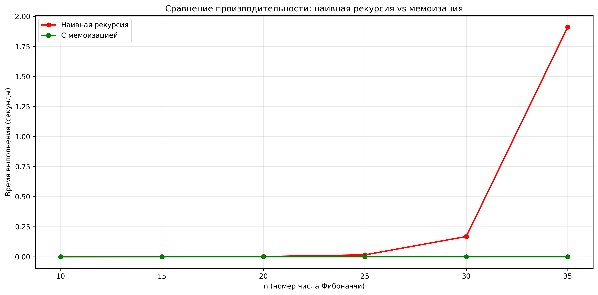

# Отчет по лабораторной работе 3. Рекурсия

**Дата:** 2025-25-11

**Семестр:** 3 курс 5 семестр

**Группа:** ПИЖ-б-о-23-2(1)

**Дисциплина:** Анализ сложности алгоритмов

**Студент:** Цапаев Данил Денисович

## Цель работы

Освоить принцип рекурсии, научиться анализировать рекурсивные алгоритмы и
 понимать механизм работы стека вызовов. Изучить типичные задачи, решаемые рекурсивно, и освоить
 технику мемоизации для оптимизации рекурсивных алгоритмов. Получить практические навыки
 реализации и отладки рекурсивных функций.

## Практическая часть

### Выполненные задачи

- [ ] Задача 1: Реализовать классические рекурсивные алгоритмы.
- [ ] Задача 2: Проанализировать их временную сложность и глубину рекурсии.
- [ ] Задача 3: Реализовать оптимизацию рекурсивных алгоритмов с помощью мемоизации.
- [ ] Задача 4: Сравнить производительность наивной рекурсии и рекурсии с мемоизацией.
- [ ] Задача 5: Решить практические задачи с применением рекурсии.

### Ключевые фрагменты кода

```PYTHON
# recursion.py
"""
Классические рекурсивные алгоритмы
"""

def factorial(n):
    """
    Вычисление факториала числа n рекурсивным методом
    
    Args:
        n (int): Неотрицательное целое число
    
    Returns:
        int: Факториал числа n
    
    Time Complexity: O(n)
    Recursion Depth: O(n)
    """
    if n < 0:
        raise ValueError("Факториал определен только для неотрицательных чисел")
    if n == 0 or n == 1:  # Базовый случай
        return 1
    return n * factorial(n - 1)  # Рекурсивный шаг


def fibonacci(n):
    """
    Вычисление n-го числа Фибоначчи наивным рекурсивным методом
    
    Args:
        n (int): Порядковый номер числа Фибоначчи
    
    Returns:
        int: n-е число Фибоначчи
    
    Time Complexity: O(2^n)
    Recursion Depth: O(n)
    """
    if n < 0:
        raise ValueError("n должно быть неотрицательным")
    if n == 0:  # Базовый случай
        return 0
    if n == 1:  # Базовый случай
        return 1
    return fibonacci(n - 1) + fibonacci(n - 2)  # Рекурсивный шаг


def fast_power(a, n):
    """
    Быстрое возведение числа a в степень n через степень двойки
    
    Args:
        a (float/int): Основание
        n (int): Показатель степени (неотрицательный)
    
    Returns:
        float/int: a в степени n
    
    Time Complexity: O(log n)
    Recursion Depth: O(log n)
    """
    if n < 0:
        raise ValueError("Показатель степени должен быть неотрицательным")
    if n == 0:  # Базовый случай
        return 1
    if n == 1:  # Базовый случай
        return a
    
    half_power = fast_power(a, n // 2)  # Рекурсивный шаг
    
    if n % 2 == 0:
        return half_power * half_power
    else:
        return a * half_power * half_power


if __name__ == "__main__":
    print("=== Тестирование рекурсивных функций ===")
    

    print(f"Факториал 5: {factorial(5)}")  # 120
    print(f"Факториал 0: {factorial(0)}")  # 1
    
    print(f"Фибоначчи(6): {fibonacci(6)}")  # 8
    print(f"Фибоначчи(10): {fibonacci(10)}")  # 55
    
    print(f"2^10: {fast_power(2, 10)}")  # 1024
    print(f"3^5: {fast_power(3, 5)}")    # 243
```

```PYTHON
# memoization.py
"""
Оптимизация рекурсивных алгоритмов с помощью мемоизации
"""

import time
from functools import wraps
from recursion import fibonacci as naive_fibonacci


def memoize(func):
    """
    Декоратор для мемоизации функции
    """
    cache = {}

    @wraps(func)
    def wrapper(*args):
        if args not in cache:
            cache[args] = func(*args)
        return cache[args]

    return wrapper


@memoize
def fibonacci_memoized(n):
    """
    Вычисление n-го числа Фибоначчи с мемоизацией

    Args:
        n (int): Порядковый номер числа Фибоначчи

    Returns:
        int: n-е число Фибоначчи

    Time Complexity: O(n) с мемоизацией
    Recursion Depth: O(n)
    """
    if n < 0:
        raise ValueError("n должно быть неотрицательным")
    if n == 0:
        return 0
    if n == 1:
        return 1
    return fibonacci_memoized(n - 1) + fibonacci_memoized(n - 2)


# Версия с явным кешированием (альтернативная реализация)
def fibonacci_explicit_memo(n, cache=None):
    """
    Вычисление n-го числа Фибоначчи с явной мемоизацией

    Args:
        n (int): Порядковый номер числа Фибоначчи
        cache (dict): Кеш для мемоизации

    Returns:
        int: n-е число Фибоначчи
    """
    if cache is None:
        cache = {}

    if n in cache:
        return cache[n]

    if n < 0:
        raise ValueError("n должно быть неотрицательным")
    if n == 0:
        return 0
    if n == 1:
        return 1

    result = fibonacci_explicit_memo(n - 1, cache) + fibonacci_explicit_memo(
        n - 2, cache
    )
    cache[n] = result
    return result


def compare_performance():
    """
    Сравнение производительности наивной и мемоизированной версий
    """
    test_values = [10, 20, 30, 35]

    print("=== Сравнение производительности ===")
    print(f"{'n':<8} {'Наивная (с)':<15} {'Мемоизация (с)':<15} {'Результат':<10}")
    print("-" * 50)

    for n in test_values:
        # Наивная версия
        start_time = time.time()
        try:
            result_naive = naive_fibonacci(n)
            time_naive = time.time() - start_time
        except RecursionError:
            result_naive = "RecursionError"
            time_naive = "N/A"

        # Мемоизированная версия
        start_time = time.time()
        result_memo = fibonacci_memoized(n)
        time_memo = time.time() - start_time

        print(f"{n:<8} {str(time_naive):<15} {time_memo:<15.6f} {result_memo:<10}")


# Дополнительная функция для подсчета вызовов
class CallCounter:
    """Класс для подсчета количества рекурсивных вызовов"""

    def __init__(self):
        self.count = 0

    def fibonacci_counted(self, n):
        """Фибоначчи с подсчетом вызовов"""
        self.count += 1
        if n <= 1:
            return n
        return self.fibonacci_counted(n - 1) + self.fibonacci_counted(n - 2)


if __name__ == "__main__":
    compare_performance()

    # Подсчет количества вызовов для n=35
    print("\n=== Подсчет количества рекурсивных вызовов для n=10 ===")
    counter = CallCounter()
    result = counter.fibonacci_counted(10)
    print(f"Количество вызовов для наивной реализации (n=10): {counter.count}")
    print(f"Результат: {result}")
```

```PYTHON
"""
Практические задачи с применением рекурсии
"""

import os


def binary_search(arr, target, low=0, high=None):
    """
    Рекурсивная реализация бинарного поиска

    Args:
        arr (list): Отсортированный массив
        target: Искомый элемент
        low (int): Нижняя граница поиска
        high (int): Верхняя граница поиска

    Returns:
        int: Индекс элемента или -1 если не найден

    Time Complexity: O(log n)
    Recursion Depth: O(log n)
    """
    if high is None:
        high = len(arr) - 1

    # Базовый случай - элемент не найден
    if low > high:
        return -1

    mid = (low + high) // 2

    # Базовый случай - элемент найден
    if arr[mid] == target:
        return mid

    # Рекурсивный шаг - поиск в левой или правой половине
    elif arr[mid] > target:
        return binary_search(arr, target, low, mid - 1)
    else:
        return binary_search(arr, target, mid + 1, high)


def recursive_file_system_tree(start_path, indent="", max_depth=None, current_depth=0):
    """
    Рекурсивный обход файловой системы

    Args:
        start_path (str): Начальный путь для обхода
        indent (str): Отступ для визуализации иерархии
        max_depth (int): Максимальная глубина рекурсии
        current_depth (int): Текущая глубина рекурсии

    Returns:
        list: Список всех найденных файлов и директорий
    """
    if max_depth is not None and current_depth > max_depth:
        return []

    try:
        items = os.listdir(start_path)
    except PermissionError:
        print(f"{indent}[Доступ запрещен] {os.path.basename(start_path)}/")
        return []
    except FileNotFoundError:
        print(f"{indent}[Путь не найден] {start_path}")
        return []

    items.sort()  # Сортировка для единообразного вывода
    result = []

    for i, item in enumerate(items):
        item_path = os.path.join(start_path, item)
        is_last = i == len(items) - 1

        if os.path.isdir(item_path):
            # Директория - рекурсивный обход
            prefix = "└── " if is_last else "├── "
            print(f"{indent}{prefix}{item}/")
            result.append(item_path + "/")

            new_indent = indent + ("    " if is_last else "│   ")
            sub_items = recursive_file_system_tree(
                item_path, new_indent, max_depth, current_depth + 1
            )
            result.extend(sub_items)
        else:
            # Файл
            prefix = "└── " if is_last else "├── "
            print(f"{indent}{prefix}{item}")
            result.append(item_path)

    return result


def hanoi_towers(n, source="A", target="C", auxiliary="B", moves=None):
    """
    Решение задачи о Ханойских башнях

    Args:
        n (int): Количество дисков
        source (str): Стержень-источник
        target (str): Стержень-назначение
        auxiliary (str): Вспомогательный стержень
        moves (list): Список для сохранения ходов

    Returns:
        list: Список ходов для решения задачи

    Time Complexity: O(2^n)
    Recursion Depth: O(n)
    """
    if moves is None:
        moves = []

    # Базовый случай - перемещение одного диска
    if n == 1:
        move = f"Переместить диск 1 со стержня {source} на стержень {target}"
        moves.append(move)
        print(move)
        return moves

    # Рекурсивный шаг:
    # 1. Переместить n-1 дисков на вспомогательный стержень
    hanoi_towers(n - 1, source, auxiliary, target, moves)

    # 2. Переместить самый большой диск на целевой стержень
    move = f"Переместить диск {n} со стержня {source} на стержень {target}"
    moves.append(move)
    print(move)

    # 3. Переместить n-1 дисков с вспомогательного на целевой стержень
    hanoi_towers(n - 1, auxiliary, target, source, moves)

    return moves


def calculate_hanoi_moves(n):
    """
    Вычисление минимального количества ходов для Ханойских башень

    Args:
        n (int): Количество дисков

    Returns:
        int: Минимальное количество ходов
    """
    if n == 1:
        return 1
    return 2 * calculate_hanoi_moves(n - 1) + 1


# Экспериментальное исследование
def experimental_analysis():
    """Проведение экспериментального исследования"""
    print("\n=== Экспериментальное исследование ===")

    # Измерение максимальной глубины рекурсии для файловой системы
    test_dir = "."  # Текущая директория
    print(f"Обход файловой системы для: {os.path.abspath(test_dir)}")
    all_items = recursive_file_system_tree(test_dir, max_depth=3)
    print(f"Найдено элементов: {len(all_items)}")

    # Анализ Ханойских башень
    print(f"\nХанойские башни для 3 дисков:")
    moves = hanoi_towers(3)
    print(f"Общее количество ходов: {len(moves)}")
    print(f"Теоретическое количество ходов: {calculate_hanoi_moves(3)}")


if __name__ == "__main__":
    # Тест бинарного поиска
    print("=== Бинарный поиск ===")
    sorted_array = [1, 3, 5, 7, 9, 11, 13, 15, 17, 19]
    target = 11
    index = binary_search(sorted_array, target)
    print(f"Массив: {sorted_array}")
    print(f"Элемент {target} найден по индексу: {index}")

    experimental_analysis()
```

```PYTHON
# performance_analyzis.py
"""
Анализ производительности и визуализация результатов
"""

import time
import matplotlib.pyplot as plt
from recursion import fibonacci as naive_fibonacci
from memoization import fibonacci_memoized
import platform
import sys
from recursion import fast_power
from recursion import factorial


def measure_performance():
    """
    Замер времени выполнения для разных n
    """
    n_values = list(range(10, 36, 5))
    times_naive = []
    times_memoized = []

    print("=== Измерение производительности ===")
    print(f"{'n':<5} {'Наивная (с)':<12} {'Мемоизация (с)':<15}")
    print("-" * 40)

    for n in n_values:
        # Наивная реализация
        start_time = time.perf_counter()
        try:
            naive_result = naive_fibonacci(n)
            naive_time = time.perf_counter() - start_time
        except RecursionError:
            naive_time = float("inf")
            naive_result = "Error"

        # Для очень быстрых вычислений делаем несколько итераций
        if naive_time < 0.001:  # Если время очень мало
            iterations = 1000
            start_time = time.perf_counter()
            try:
                for _ in range(iterations):
                    naive_fibonacci(n)
                naive_time = (time.perf_counter() - start_time) / iterations
            except RecursionError:
                pass

        # Мемоизированная реализация
        start_time = time.perf_counter()
        memo_result = fibonacci_memoized(n)
        memo_time = time.perf_counter() - start_time

        # Для очень быстрых вычислений делаем несколько итераций
        if memo_time < 0.001:  # Если время очень мало
            iterations = 10000  # Больше итераций для очень быстрой функции
            start_time = time.perf_counter()
            for _ in range(iterations):
                fibonacci_memoized(n)
            memo_time = (time.perf_counter() - start_time) / iterations

        times_naive.append(naive_time if naive_time != float("inf") else None)
        times_memoized.append(memo_time)

        # Форматируем вывод для очень малых значений
        naive_str = (
            f"{naive_time:.6f}" if naive_time >= 0.000001 else f"{naive_time:.2e}"
        )
        memo_str = f"{memo_time:.6f}" if memo_time >= 0.000001 else f"{memo_time:.2e}"

        print(f"{n:<5} {naive_str:<12} {memo_str:<15}")

    return n_values, times_naive, times_memoized


def plot_comparison(n_values, times_naive, times_memoized):
    """
    Построение графика сравнения производительности
    """
    plt.figure(figsize=(12, 6))

    # Фильтруем значения, где наивная реализация не вызвала ошибку
    valid_indices = [i for i, t in enumerate(times_naive) if t is not None and t > 0]
    valid_n = [n_values[i] for i in valid_indices]
    valid_naive = [times_naive[i] for i in valid_indices]
    valid_memo = [times_memoized[i] for i in valid_indices]

    plt.plot(
        valid_n, valid_naive, "ro-", label="Наивная рекурсия", linewidth=2, markersize=6
    )
    plt.plot(
        n_values,
        times_memoized,
        "go-",
        label="С мемоизацией",
        linewidth=2,
        markersize=6,
    )

    plt.xlabel("n (номер числа Фибоначчи)")
    plt.ylabel("Время выполнения (секунды)")
    plt.title("Сравнение производительности: наивная рекурсия vs мемоизация")
    plt.legend()
    plt.grid(True, alpha=0.3)

    plt.tight_layout()
    plt.savefig("fibonacci_performance.png", dpi=300, bbox_inches="tight")
    plt.show()


def analyze_recursion_depth():
    """
    Анализ глубины рекурсии для разных алгоритмов
    """
    print("\n=== Анализ глубины рекурсии ===")

    original_limit = sys.getrecursionlimit()
    print(f"Текущий лимит рекурсии: {original_limit}")

    # Тестирование на разных значениях
    test_values = [5, 10, 20, 100, 500, 1000]

    print(f"{'n':<8} {'Факториал':<12} {'Быстрая степень':<18}")
    print("-" * 45)

    for n in test_values:
        try:
            # Факториал - глубина рекурсии O(n)
            factorial(n)
            fact_ok = "✓"
        except RecursionError:
            fact_ok = "✗"

        try:
            # Быстрая степень - глубина рекурсии O(log n)
            fast_power(2, n)
            power_ok = "✓"
        except RecursionError:
            power_ok = "✗"

        print(f"{n:<8} {fact_ok:<12} {power_ok:<18}")


if __name__ == "__main__":
    # Характеристики ПК

    print("=== Характеристики тестовой системы ===")
    print(f"ОС: {platform.system()} {platform.release()}")
    print(f"Процессор: {platform.processor()}")
    print(f"Память: 16.0 GB")
    print(f"Python: {platform.python_version()}")

    # Измерение производительности
    n_vals, naive_times, memo_times = measure_performance()

    # Построение графиков
    plot_comparison(n_vals, naive_times, memo_times)

    # Анализ глубины рекурсии
    analyze_recursion_depth()
```

### Визуализация бенчмаркинга

```BASH
=== Характеристики тестовой системы ===
ОС: Windows 11
Процессор: AMD64 Family 25 Model 80 Stepping 0, AuthenticAMD
Память: 16.0 GB
Python: 3.12.6
=== Измерение производительности ===
n     Наивная (с)  Мемоизация (с)
----------------------------------------
10    0.000011     1.20e-07       
15    0.000129     1.17e-07       
20    0.001554     1.16e-07
25    0.015605     1.09e-07       
30    0.168446     1.13e-07       
35    1.911451     1.27e-07       

=== Анализ глубины рекурсии ===
Текущий лимит рекурсии: 1000
n        Факториал    Быстрая степень
---------------------------------------------
5        ✓            ✓
10       ✓            ✓
20       ✓            ✓
100      ✓            ✓
500      ✓            ✓
1000     ✗            ✓
```



## Ответы на контрольные вопросы

## 1. Базовый случай и рекурсивный шаг. Почему отсутствие базового случая приводит к ошибке

- **Базовый случай (условие выхода)** — Обязательное условие, которое прекращает рекурсивные
 вызовы и предотвращает зацикливание.
- **Рекурсивный шаг** — Шаг, на котором задача разбивается на более простую подзадачу того же
 типа и производится рекурсивный вызов.

Если **базового случая нет**, функция будет вызывать саму себя бесконечно, что приведёт к **переполнению стека вызовов (RecursionError)** — программа не сможет завершить вычисления.

---

## 2. Как работает мемоизация и как она влияет на вычисление чисел Фибоначчи

**Мемоизация** —  Техника оптимизации, позволяющая избежать повторных
 вычислений результатов функций для одних и тех же входных данных путем сохранения ранее
 вычисленных результатов в кеше (например, в словаре).

### Пример влияния на сложность

- **Наивная рекурсия** для чисел Фибоначчи: `O(2^n)` — из-за повторных пересчётов одних и тех же значений.  
- **С мемоизацией**: `O(n)` — каждое значение вычисляется один раз и сохраняется.

---

## 3. Проблема глубокой рекурсии и её связь со стеком вызовов

Каждый рекурсивный вызов занимает место в **стеке вызовов**, где хранятся локальные переменные и адрес возврата.  
При слишком большой глубине рекурсии стек переполняется, и программа завершает работу с ошибкой `RecursionError`.  
Это особенно актуально для языков с ограниченным размером стека (например, Python по умолчанию ограничивает глубину до ~1000 вызовов).

---

## 4. Алгоритм решения задачи о Ханойских башнях для 3 дисков

Задача: нужно переместить 3 диска с **стержня A** на **стержень C**, используя **стержень B** как вспомогательный.

### Алгоритм

1. Переместить 2 верхних диска с A → B (используя C как вспомогательный).
2. Переместить нижний (третий) диск с A → C.
3. Переместить 2 диска с B → C (используя A как вспомогательный).

### Последовательность шагов

1. A → C  
2. A → B  
3. C → B  
4. A → C  
5. B → A  
6. B → C  
7. A → C  

**Всего шагов:** 7 = 2³ − 1.  
Общая сложность: **O(2ⁿ)**.

---

## 5. Рекурсивные и итеративные алгоритмы: преимущества и недостатки

| Подход | Преимущества | Недостатки |
|--------|---------------|------------|
| **Рекурсивный** | Простой и наглядный код, легко описывает задачи, основанные на самоподобии (деревья, графы, Ханойские башни). | Использует стек вызовов, может вызвать переполнение при большой глубине; иногда медленнее из-за накладных расходов на вызовы функций. |
| **Итеративный** | Эффективен по памяти, не зависит от глубины рекурсии, быстрее при больших объёмах данных. | Код может быть сложнее и менее интуитивен для задач с рекурсивной природой. |

---
