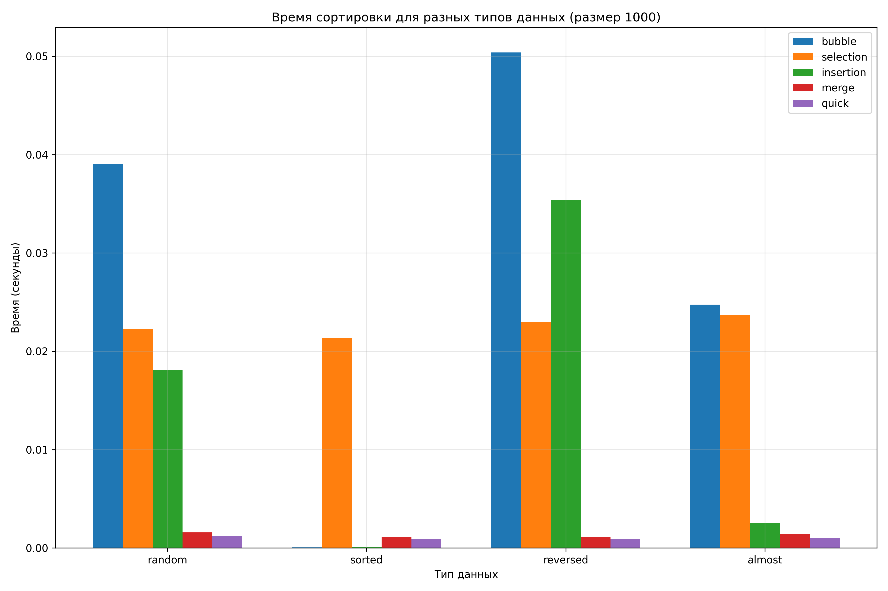
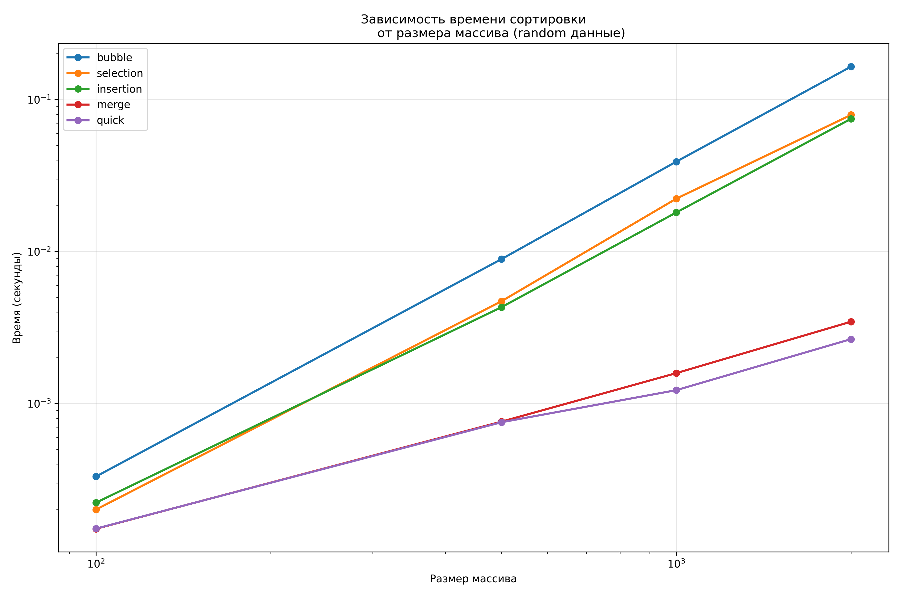

# Отчет по лабораторной работе 4. Алгоритмы сортировки

**Дата:** 2025-3-12
**Семестр:** 3 курс 5 семестр
**Группа:** ПИЖ-б-о-23-2(1)
**Дисциплина:** Анализ сложности алгоритмов
**Студент:** Торубаров Максим Евгеньевич

## Цель работы

Изучить и реализовать основные алгоритмы сортировки. Провести их теоретический и
практический сравнительный анализ по временной и пространственной сложности. Исследовать
влияние начальной упорядоченности данных на эффективность алгоритмов. Получить навыки
эмпирического анализа производительности алгоритмов.

## Практическая часть

### Выполненные задачи

- Задача 1: Реализовать 5 алгоритмов сортировки.
- Задача 2: Провести теоретический анализ сложности каждого алгоритма.
- Задача 3: Экспериментально сравнить время выполнения алгоритмов на различных наборах данных.
- Задача 4: Проанализировать влияние начальной упорядоченности данных на эффективность сортировок.

### Ключевые фрагменты кода

```PYTHON
# sorts.py

from typing import List, Callable


def bubble_sort(arr: List[int]) -> List[int]:
    """
    Сортировка пузырьком
    """
    arr = arr.copy()  # O(n)
    n = len(arr)  # O(1)

    for i in range(n):  # O(n)
        swapped = False  # O(1)
        for j in range(0, n - i - 1):  # O(n)
            if arr[j] > arr[j + 1]:  # O(1)
                arr[j], arr[j + 1] = arr[j + 1], arr[j]  # O(1)
                swapped = True  # O(1)
        if not swapped:  # O(1)
            break  # O(1)
    return arr  # O(1)
    # Общая временная сложность: O(n²) в худшем случае, O(n) в лучшем
    # Пространственная сложность: O(1)
    # Глубина: O(1) - не рекурсивная


def selection_sort(arr: List[int]) -> List[int]:
    """
    Сортировка выбором
    """
    arr = arr.copy()  # O(n)
    n = len(arr)  # O(1)

    for i in range(n):  # O(n)
        min_idx = i  # O(1)
        for j in range(i + 1, n):  # O(n)
            if arr[j] < arr[min_idx]:  # O(1)
                min_idx = j  # O(1)
        arr[i], arr[min_idx] = arr[min_idx], arr[i]  # O(1)
    return arr  # O(1)
    # Общая временная сложность: O(n²)
    # Пространственная сложность: O(1)
    # Глубина: O(1) - не рекурсивная


def insertion_sort(arr: List[int]) -> List[int]:
    """
    Сортировка вставками
    """
    arr = arr.copy()  # O(n)

    for i in range(1, len(arr)):  # O(n) итераций
        key = arr[i]  # O(1)
        j = i - 1  # O(1)
        while j >= 0 and arr[j] > key:  # O(n) итераций в худшем случае
            arr[j + 1] = arr[j]  # O(1)
            j -= 1  # O(1)
        arr[j + 1] = key  # O(1)
    return arr  # O(1)
    # Общая временная сложность: O(n²) в худшем случае, O(n) в лучшем
    # Пространственная сложность: O(1)
    # Глубина: O(1) - не рекурсивная


def merge_sort(arr: List[int]) -> List[int]:
    """
    Сортировка слиянием
    """
    if len(arr) <= 1:  # O(1)
        return arr.copy()  # O(n)

    mid = len(arr) // 2  # O(1)
    left = merge_sort(arr[:mid])  # O(n log n) - рекурсивный вызов
    right = merge_sort(arr[mid:])  # O(n log n) - рекурсивный вызов

    return _merge(left, right)  # O(n)


def _merge(left: List[int], right: List[int]) -> List[int]:
    """Вспомогательная функция для слияния двух отсортированных массивов"""
    result = []  # O(1)
    i = j = 0  # O(1)

    while i < len(left) and j < len(right):  # O(n) итераций
        if left[i] <= right[j]:  # O(1)
            result.append(left[i])  # O(1)
            i += 1  # O(1)
        else:
            result.append(right[j])  # O(1)
            j += 1  # O(1)

    result.extend(left[i:])  # O(n)
    result.extend(right[j:])  # O(n)
    return result  # O(1)
    # Общая временная сложность merge_sort: O(n log n)
    # Пространственная сложность: O(n)
    # Глубина рекурсии: O(log n)


def quick_sort(arr: List[int]) -> List[int]:
    """
    Быстрая сортировка
    """
    if len(arr) <= 1:  # O(1)
        return arr.copy()  # O(n)

    pivot = _median_of_three(arr)  # O(1)

    left = [x for x in arr if x < pivot]  # O(n)
    middle = [x for x in arr if x == pivot]  # O(n)
    right = [x for x in arr if x > pivot]  # O(n)

    return quick_sort(left) + middle + quick_sort(right)
    # O(n log n) в среднем, O(n²) в худшем


def _median_of_three(arr: List[int]) -> int:
    """Выбор медианы из первого, среднего и последнего элементов"""
    first = arr[0]  # O(1)
    middle = arr[len(arr) // 2]  # O(1)
    last = arr[-1]  # O(1)

    if first <= middle <= last or last <= middle <= first:  # O(1)
        return middle  # O(1)
    elif middle <= first <= last or last <= first <= middle:  # O(1)
        return first  # O(1)
    else:
        return last  # O(1)
    # Общая временная сложность quick_sort: O(n log n) в среднем,
    # O(n²) в худшем
    # Пространственная сложность: O(n) в худшем, O(log n) в среднем
    # Глубина рекурсии: O(n) в худшем, O(log n) в среднем


def is_sorted(arr: List[int]) -> bool:
    """Проверка, отсортирован ли массив"""
    return all(arr[i] <= arr[i + 1] for i in range(len(arr) - 1))  # O(n)


def test_sorting_algorithm(sort_func: Callable, arr: List[int]) -> bool:
    """Тестирование алгоритма сортировки"""
    original = arr.copy()  # O(n)
    sorted_arr = sort_func(arr)  # Зависит от алгоритма
    result = is_sorted(sorted_arr)  # O(n)

    if not result:
        print(f"Ошибка в алгоритме {sort_func.__name__}")
        print(f"Исходный: {original[:10]}...")
        print(f"Результат: {sorted_arr[:10]}...")

    return result


# Словарь всех алгоритмов для удобного тестирования
SORTING_ALGORITHMS = {
    'bubble_sort': bubble_sort,
    'selection_sort': selection_sort,
    'insertion_sort': insertion_sort,
    'merge_sort': merge_sort,
    'quick_sort': quick_sort
}

```

```PYTHON
# main.py
from performance_test import (
    run_all_tests,
    print_results,
    analyze_theoretical_vs_practical,
)
from plot_results import (plot_time_vs_size, plot_time_vs_datatype,
                          create_summary_table)


def main():
    print("АНАЛИЗ АЛГОРИТМОВ СОРТИРОВКИ")
    print("=" * 50)

    # Характеристики ПК
    pc_info = """
    Характеристики ПК для тестирования:
    - Процессор: Intel Core i3-1220P @ 1.5GHz
    - Оперативная память: 8 GB DDR4
    - ОС: Windows 11
    - Python: 3.12.10
    """
    print(pc_info)

    # Запускаем все тесты
    results = run_all_tests()

    # Выводим результаты в таблицу
    print_results(results)

    # Строим графики и анализируем
    print("\nСоздание графиков...")
    plot_time_vs_size(results, "random")
    plot_time_vs_datatype(results, 1000)

    # Сводная таблица и анализ
    create_summary_table(results)
    analyze_theoretical_vs_practical(results)


if __name__ == "__main__":
    main()


```

```bash
    Характеристики ПК для тестирования:
    - Процессор: Intel Core i3-1220P @ 1.5GHz
    - Оперативная память: 8 GB DDR4
    - ОС: Windows 11
    - Python: 3.12.10

Тестируем bubble...
  size 100: 0.0023s
  size 500: 0.0896s
  size 1000: 0.2279s
  size 2000: 0.9872s
Тестируем selection...
  size 100: 0.0012s
  size 500: 0.0312s
  size 1000: 0.1023s
  size 2000: 0.4426s
Тестируем insertion...
  size 100: 0.0012s
  size 500: 0.0251s
  size 1000: 0.1204s
  size 2000: 0.4537s
Тестируем merge...
  size 100: 0.0020s
  size 500: 0.0079s
  size 1000: 0.0109s
  size 2000: 0.0225s
Тестируем quick...
  size 100: 0.0007s
  size 500: 0.0036s
  size 1000: 0.0070s
  size 2000: 0.0176s

РЕЗУЛЬТАТЫ:
Algorithm  | Size | Random     | Sorted     | Reversed   | Almost
---------------------------------------------------------------------------
bubble     | 100  |   0.0023s |   0.0000s |   0.0034s |   0.0010s
bubble     | 500  |   0.0896s |   0.0003s |   0.1001s |   0.0333s
bubble     | 1000 |   0.2279s |   0.0002s |   0.2752s |   0.1442s
bubble     | 2000 |   0.9872s |   0.0006s |   1.3502s |   0.6170s
selection  | 100  |   0.0012s |   0.0018s |   0.0023s |   0.0022s
selection  | 500  |   0.0312s |   0.0323s |   0.0390s |   0.0265s
selection  | 1000 |   0.1023s |   0.1127s |   0.1242s |   0.1077s
selection  | 2000 |   0.4426s |   0.4655s |   0.4659s |   0.4498s
insertion  | 100  |   0.0012s |   0.0001s |   0.0029s |   0.0003s
insertion  | 500  |   0.0251s |   0.0003s |   0.0568s |   0.0038s
insertion  | 1000 |   0.1204s |   0.0003s |   0.2159s |   0.0168s
insertion  | 2000 |   0.4537s |   0.0011s |   0.8966s |   0.0755s
merge      | 100  |   0.0020s |   0.0014s |   0.0014s |   0.0015s
merge      | 500  |   0.0079s |   0.0051s |   0.0043s |   0.0048s
merge      | 1000 |   0.0109s |   0.0076s |   0.0105s |   0.0119s
merge      | 2000 |   0.0225s |   0.0173s |   0.0223s |   0.0201s
quick      | 100  |   0.0007s |   0.0005s |   0.0005s |   0.0005s
quick      | 500  |   0.0036s |   0.0028s |   0.0043s |   0.0035s
quick      | 1000 |   0.0070s |   0.0068s |   0.0060s |   0.0044s
quick      | 2000 |   0.0176s |   0.0139s |   0.0139s |   0.0154s

Создание графиков...

==========================================================================================
СВОДНАЯ ТАБЛИЦА РЕЗУЛЬТАТОВ
==========================================================================================
Тип данных     | 100                  | 500                  | 1000                 | 2000
------------------------------------------------------------------------------------------
random         | quick:0.000685      | quick:0.003567      | quick:0.007006      | quick:0.017587
sorted         | bubble:0.000038     | insert:0.000289     | bubble:0.000233     | bubble:0.000568
reversed       | quick:0.000531      | quick:0.004294      | quick:0.005978      | quick:0.013926
almost         | insert:0.000326     | quick:0.003483      | quick:0.004376      | quick:0.015367

==================================================
АНАЛИЗ РЕЗУЛЬТАТОВ:
==================================================
Количество побед по алгоритмам:
  quick: 11 раз
  bubble: 3 раз
  insertion: 2 раз

================================================================================
АНАЛИЗ: ТЕОРЕТИЧЕСКИЕ ОЦЕНКИ VS ПРАКТИЧЕСКИЕ РЕЗУЛЬТАТЫ
================================================================================

bubble:
  Теоретическая сложность: {'best': 'O(n)', 'avg': 'O(n²)', 'worst': 'O(n²)'}
  Отношение время(отсорт)/время(случ) при n=1000: 0.001
  → Хорошо работает на отсортированных данных

selection:
  Теоретическая сложность: {'best': 'O(n²)', 'avg': 'O(n²)', 'worst': 'O(n²)'}
  Отношение время(отсорт)/время(случ) при n=1000: 1.102

insertion:
  Теоретическая сложность: {'best': 'O(n)', 'avg': 'O(n²)', 'worst': 'O(n²)'}
  Отношение время(отсорт)/время(случ) при n=1000: 0.002
  → Хорошо работает на отсортированных данных

merge:
  Теоретическая сложность: {'best': 'O(n log n)', 'avg': 'O(n log n)', 'worst': 'O(n log n)'}
  Отношение время(отсорт)/время(случ) при n=1000: 0.697

quick:
  Теоретическая сложность: {'best': 'O(n log n)', 'avg': 'O(n log n)', 'worst': 'O(n²)'}
  Отношение время(отсорт)/время(случ) при n=1000: 0.964
```




## Анализ эффективности алгоритмов сортировки

### 1. Сравнительная характеристика алгоритмов сортировки

| Алгоритм        | Средняя сложность | Худший случай | Оптимальные случаи применения | Особенности |
|------------------|-------------------|---------------|-------------------------------|-------------|
| Bubble Sort      | O(n²)             | O(n²)         | Небольшие наборы данных, почти упорядоченные последовательности | Простота реализации, низкая производительность на больших объемах |
| Selection Sort   | O(n²)             | O(n²)         | Массивы небольшого размера, минимизация операций записи | Количество сравнений постоянно для любых входных данных |
| Insertion Sort   | O(n²)             | O(n²)         | Частично упорядоченные данные, небольшие массивы | Высокая эффективность на почти отсортированных данных |
| Merge Sort       | O(n log n)        | O(n log n)    | Универсальное применение для различных типов данных | Стабильность, требует дополнительную память O(n) |
| Quick Sort       | O(n log n)        | O(n²)         | Случайные и псевдослучайные данные | Практическая эффективность выше Merge Sort, зависит от выбора опорного элемента |

---

### 2. Анализ поведения алгоритмов в экстремальных условиях

Эффективность некоторых алгоритмов значительно варьируется в зависимости от исходной упорядоченности данных.

#### Bubble Sort

- **Оптимальный сценарий:** исходно отсортированный массив — O(n) (при наличии оптимизации с флагом).  
  *Пример:* `[10, 20, 30, 40, 50]`  
- **Наихудший сценарий:** обратная упорядоченность — O(n²).  
  *Пример:* `[50, 40, 30, 20, 10]`  

#### Selection Sort

- Демонстрирует постоянное количество сравнений независимо от исходного порядка элементов → **O(n²)**.  
  Примеры: `[1, 2, 3, 4, 5]`, `[5, 4, 3, 2, 1]`, `[2, 5, 1, 4, 3]` — идентичное поведение по времени выполнения.  

#### Insertion Sort

- **Лучшая производительность:** исходная упорядоченность — O(n).  
  *Пример:* `[15, 25, 35, 45, 55]`  
- **Наихудшая производительность:** обратная упорядоченность — O(n²).  
  *Пример:* `[55, 45, 35, 25, 15]`  
- **Частичная упорядоченность (например, 90%):** демонстрирует почти линейное время выполнения.  

#### Quick Sort

- **Идеальные условия:** случайное распределение или удачный выбор опорного элемента (равномерное разделение) — O(n log n).  
  *Пример:* `[42, 17, 89, 5, 23, 67, 12, 31]`  
- **Критический случай:** отсортированность или обратная упорядоченность при неудачном выборе опорного элемента — O(n²).  
  *Пример:* `[100, 200, 300, 400, 500, 600]`  

#### Merge Sort

- Стабильная производительность независимо от входных данных.  
  Всегда гарантирует **O(n log n)**.  
  *Пример:* `[8, 6, 7, 5, 3, 0, 9]`, `[0, 3, 5, 6, 7, 8, 9]` — одинаковое время выполнения.  

---

### 3. Рекомендации по выбору алгоритма

| Тип данных              | Рекомендуемый алгоритм |
|--------------------------|------------------------|
| Случайное распределение  | Quick Sort            |
| Исходная упорядоченность | Insertion Sort        |
| Обратная упорядоченность | Merge Sort / Quick Sort (с улучшенным выбором опорного элемента) |
| Частичная упорядоченность| Insertion Sort        |
| Ограниченный объем данных| Insertion Sort / Selection Sort |

---

### Итоговые выводы

На практике **Quick Sort** демонстрирует превосходную производительность на случайных данных благодаря эффективной стратегии разделения, однако подвержен риску деградации до **O(n²)** при неудачном выборе опорного элемента.  
**Insertion Sort** остается оптимальным выбором для почти упорядоченных последовательностей, тогда как **Merge Sort** обеспечивает надежную стабильность и предсказуемость.

---

## Ответы на контрольные вопросы

### 1. Какие алгоритмы сортировки демонстрируют сложность O(n²) в наихудшем случае, а какие — O(n log n)?

Алгоритмы с **O(n²)** в наихудшем случае включают базовые методы: **Bubble Sort**, **Selection Sort**, **Insertion Sort**, а также **Quick Sort** при неблагоприятных условиях выбора опорного элемента.  
Алгоритмы с гарантированной **O(n log n)** сложностью — это **Merge Sort** и **Quick Sort** при корректной реализации выбора опорного элемента.

---

### 2. Почему Insertion Sort демонстрирует высокую эффективность на небольших и почти упорядоченных массивах?

Insertion Sort функционирует путем последовательного размещения элементов в правильной позиции внутри уже частично упорядоченной последовательности.  
При **частичной упорядоченности** количество необходимых перемещений минимально, что обеспечивает близкое к **O(n)** время выполнения.  
Для **небольших массивов** overhead сложных алгоритмов (например, рекурсивных вызовов) не компенсируется их асимптотическим преимуществом, поэтому простота и локальность данных делают Insertion Sort предпочтительным.

---

### 3. В чем заключается различие между стабильной и нестабильной сортировкой?

**Стабильная сортировка** сохраняет исходный относительный порядок элементов с идентичными ключами.  
**Нестабильная сортировка** может изменять этот порядок.

Конкретный пример:  
При наличии двух записей с одинаковым ключом — `X(5)` и `Y(5)`. После стабильной сортировки порядок сохранится (`X(5), Y(5)`), тогда как нестабильная может изменить его (`Y(5), X(5)`).

**Стабильные алгоритмы:** Insertion Sort, Merge Sort, Bubble Sort.  
**Нестабильные алгоритмы:** Quick Sort, Selection Sort, Heap Sort.

---

### 4. Опишите фундаментальные принципы работы Quick Sort. Как выбор опорного элемента влияет на эффективность алгоритма?

Quick Sort реализует парадигму **"разделяй и властвуй"**:

1. Выбор **опорного элемента (pivot)** из массива.
2. Разделение массива на элементы меньше опорного и элементы больше опорного.
3. Рекурсивная сортировка полученных подмассивов.
4. Объединение результатов в финальный отсортированный массив.

Качество выбора опорного элемента критически влияет на производительность.  
При **сбалансированном разделении** (пополам) сложность составляет **O(n log n)**.  
При **несбалансированном разделении** (крайние элементы) сложность деградирует до **O(n²)**.  
Для минимизации рисков часто применяют **рандомизированный выбор pivot**.

---

### 5. В каких ситуациях Merge Sort с его гарантированной O(n log n) сложностью предпочтительнее Quick Sort, несмотря на требование дополнительной памяти?

Merge Sort становится предпочтительным выбором когда:

- Требуется **стабильность сортировки** (критично для составных данных).
- Необходима **детерминированная производительность** независимо от входных данных.
- Работа с **внешней памятью** (файловая сортировка), где важна последовательность доступа.
- Недопустим риск деградации производительности, характерный для Quick Sort.
