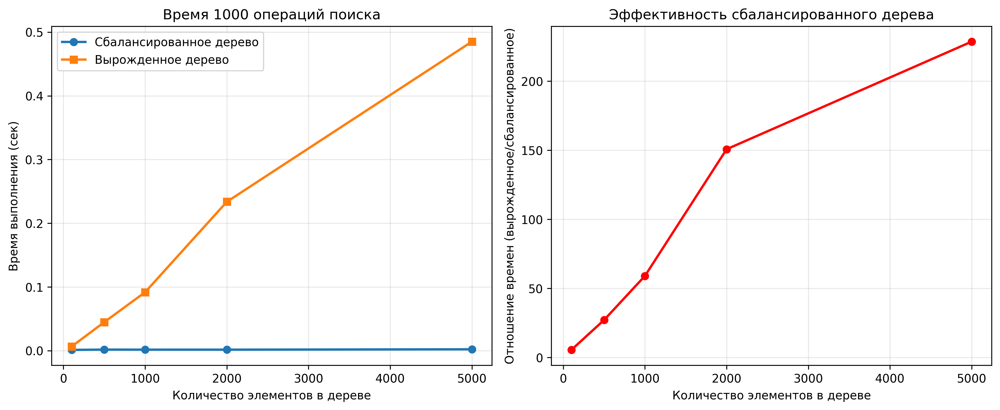

# Отчет по лабораторной работе 6. Деревья. Бинарные деревья поиска

**Дата:** 2025-03-12

**Семестр:** 3 курс 5 семестр

**Группа:** ПИЖ-б-о-23-2(1)

**Дисциплина:** Анализ сложности алгоритмов

**Студент:** Цапаев Данил Денисович

## Цель работы

Изучить древовидные структуры данных, их свойства и применение. Освоить основные
 операции с бинарными деревьями поиска (BST). Получить практические навыки реализации BST на
 основе узлов (pointer-based), рекурсивных алгоритмов обхода и анализа их эффективности.
 Исследовать влияние сбалансированности дерева на производительность операций.

## Практическая часть

### Выполненные задачи

- Задача 1: Реализовать бинарное дерево поиска на основе узлов с основными операциями.
- Задача 2: Реализовать различные методы обхода дерева (рекурсивные и итеративные).
- Задача 3: Реализовать дополнительные методы для работы с BST.
- Задача 4: Провести анализ сложности операций для сбалансированного и вырожденного деревьев.
- Задача 5: Визуализировать структуру дерева.

### Ключевые фрагменты кода

```PYTHON
# binary_search_tree.py
from collections import deque


class TreeNode:
    """Класс узла BST"""

    def __init__(self, value):
        self.value = value
        self.left = None
        self.right = None

    def __str__(self):
        return f"TreeNode({self.value})"


class BinarySearchTree:
    """Класс BST"""

    def __init__(self):
        self.root = None

    def is_empty(self):
        """Проверка дерева на наличие узлов"""
        return self.root is None
        # Временная сложность: O(1)

    def insert(self, value):
        """Метод для вставки узла"""
        if self.is_empty():
            self.root = TreeNode(value)
        else:
            self.insert_recursive(self.root, value)
        # Временная сложность: O(log n) в среднем, O(n) в худшем

    def insert_recursive(self, node, value):
        """Вспомогательный рекурсивный метод втсавки узла"""
        if value < node.value:
            if node.left is None:
                node.left = TreeNode(value)
            else:
                self.insert_recursive(node.left, value)
        elif value > node.value:
            if node.right is None:
                node.right = TreeNode(value)
            else:
                self.insert_recursive(node.right, value)
        # Временная сложность: O(log n) в среднем, O(n) в худшем

    def search(self, value):
        """Метод поиска узла в дереве"""
        if self.root is None:
            return "Элемент не найден, дерево пустое"
        else:
            return self.search_recursive(self.root, value)
        # Временная сложность: O(log n) в среднем, O(n) в худшем

    def search_recursive(self, node, value):
        """Вспомогательный рекурсивный метод для поиска узла"""
        if node.value == value:
            return node
        elif value < node.value:
            if node.left is None:
                return "Элемент не найден"
            else:
                return self.search_recursive(node.left, value)
        else:
            if node.right is None:
                return "Элемент не найден"
            else:
                return self.search_recursive(node.right, value)
        # Временная сложность: O(log n) в среднем, O(n) в худшем

    def delete(self, value):
        """Метод удаления узла из дерева"""
        if self.root is None:
            return "Дерево пустое, нельзя произвести удаление узла"
        else:
            self.root = self.delete_recursive(self.root, value)
        # Временная сложность: O(log n) в среднем, O(n) в худшем

    def delete_recursive(self, node, value):
        """Вспомогательный рекурсивный метод для удаления узла"""
        if node is None:
            return node

        if value < node.value:
            node.left = self.delete_recursive(node.left, value)
        elif value > node.value:
            node.right = self.delete_recursive(node.right, value)
        else:
            if node.left is None:
                return node.right
            elif node.right is None:
                return node.left

            successor = self.find_min(node.right)
            node.value = successor.value
            node.right = self.delete_recursive(node.right, successor.value)

        return node
        # Временная сложность: O(log n) в среднем, O(n) в худшем

    def find_min(self, node):
        """Метод для поиска минимального узла в поддереве"""
        current = node
        while current and current.left:
            current = current.left
        return current
        # Временная сложность: O(log n) в среднем, O(n) в худшем

    def find_max(self, node):
        """Метод для поиска максимального узла в поддереве"""
        current = node
        while current and current.right:
            current = current.right
        return current
        # Временная сложность: O(log n) в среднем, O(n) в худшем

    def is_valid(self):
        """Проверяет, является ли дерево валидным BST"""
        if self.root is None:
            return True  # Пустое дерево считается валидным BST

        return self._is_valid_recursive(self.root, float("-inf"), float("inf"))
        # Временная сложность: O(n) - нужно проверить все узлы

    def _is_valid_recursive(self, node, min_val, max_val):
        """
        Вспомогательный рекурсивный метод проверки валидности BST
        min_val и max_val задают допустимый диапазон значений для узла
        """
        if node is None:
            return True

        # Проверяем, что значение узла находится в допустимом диапазоне
        if not (min_val < node.value < max_val):
            return False

        # Рекурсивно проверяем левое и правое поддеревья
        return self._is_valid_recursive(
            node.left, min_val, node.value
        ) and self._is_valid_recursive(node.right, node.value, max_val)
        # Временная сложность: O(n)

    def height(self, node=None):
        """Получение высоты дерева/поддерева"""
        if node is None:
            node = self.root

        if node is None:
            return -1

        queue = deque([(node, 0)])
        max_height = 0

        while queue:
            current, level = queue.popleft()
            max_height = max(max_height, level)

            if current.left:
                queue.append((current.left, level + 1))
            if current.right:
                queue.append((current.right, level + 1))

        return max_height
```

```PYTHON
# tree_traversal.py
def in_order_recursive(node):
    """
    Рекурсивный in-order обход (левый-корень-правый)
    Выводит элементы в отсортированном порядке
    """
    if node:
        in_order_recursive(node.left)  # Рекурсивно обойти левое поддерево
        print(node.value, end=" ")  # Посетить корень
        in_order_recursive(node.right)  # Рекурсивно обойти правое поддерево


def pre_order_recursive(node):
    """
    Рекурсивный pre-order обход (корень-левый-правый)
    Полезен для копирования структуры дерева
    """
    if node:
        print(node.value, end=" ")  # Посетить корень
        pre_order_recursive(node.left)  # Рекурсивно обойти левое поддерево
        pre_order_recursive(node.right)  # Рекурсивно обойти правое поддерево


def post_order_recursive(node):
    """
    Рекурсивный post-order обход (левый-правый-корень)
    Полезен для удаления дерева
    """
    if node:
        post_order_recursive(node.left)  # Рекурсивно обойти левое поддерево
        post_order_recursive(node.right)  # Рекурсивно обойти правое поддерево
        print(node.value, end=" ")  # Посетить корень


def in_order_iterative(root):
    """
    Итеративный in-order обход с использованием стека
    Выводит элементы в отсортированном порядке
    """
    stack = []
    current = root

    while True:
        # Дойти до самого левого узла текущего поддерева
        if current is not None:
            stack.append(current)  # Добавить узел в стек
            current = current.left  # Перейти к левому потомку

        # Возвращение из пустого поддерева
        elif stack:
            current = stack.pop()  # Взять узел из стека
            print(current.value, end=" ")  # Обработать узел
            current = current.right  # Перейти к правому поддереву

        else:
            break  # Обход завершен
```

```PYTHON
# tests.py
import unittest
from Modules.binary_search_tree import TreeNode, BinarySearchTree

from Modules.tree_traversal import (
    in_order_recursive,
    pre_order_recursive,
    post_order_recursive,
    in_order_iterative,
)


class TestBinarySearchTree(unittest.TestCase):

    def setUp(self):
        """Настройка тестового окружения перед каждым тестом"""
        self.bst = BinarySearchTree()

    def test_initial_state(self):
        """Тест начального состояния дерева"""
        self.assertTrue(self.bst.is_empty())
        self.assertIsNone(self.bst.root)

    def test_insert_into_empty_tree(self):
        """Тест вставки в пустое дерево"""
        self.bst.insert(10)
        self.assertFalse(self.bst.is_empty())
        self.assertEqual(self.bst.root.value, 10)
        self.assertIsNone(self.bst.root.left)
        self.assertIsNone(self.bst.root.right)

    def test_insert_multiple_values(self):
        """Тест вставки нескольких значений"""
        values = [8, 3, 10, 1, 6, 14, 4, 7, 13]
        for value in values:
            self.bst.insert(value)

        # Проверка структуры дерева
        self.assertEqual(self.bst.root.value, 8)
        self.assertEqual(self.bst.root.left.value, 3)
        self.assertEqual(self.bst.root.right.value, 10)
        self.assertEqual(self.bst.root.left.left.value, 1)
        self.assertEqual(self.bst.root.left.right.value, 6)

    def test_bst_property_after_insert(self):
        """Тест свойства BST после вставки"""
        values = [5, 3, 7, 2, 4, 6, 8]
        for value in values:
            self.bst.insert(value)

        # Дерево должно оставаться валидным BST
        self.assertTrue(self.bst.is_valid())

    def test_search_existing_elements(self):
        """Тест поиска существующих элементов"""
        values = [5, 3, 7, 2, 4, 6, 8]
        for value in values:
            self.bst.insert(value)

        for value in values:
            result = self.bst.search(value)
            self.assertIsInstance(result, TreeNode)
            self.assertEqual(result.value, value)

    def test_search_non_existing_elements(self):
        """Тест поиска несуществующих элементов"""
        values = [5, 3, 7]
        for value in values:
            self.bst.insert(value)

        result = self.bst.search(10)
        self.assertEqual(result, "Элемент не найден")

        result = self.bst.search(1)
        self.assertEqual(result, "Элемент не найден")

    def test_search_in_empty_tree(self):
        """Тест поиска в пустом дереве"""
        result = self.bst.search(5)
        self.assertEqual(result, "Элемент не найден, дерево пустое")

    def test_delete_leaf_node(self):
        """Тест удаления листового узла"""
        values = [5, 3, 7, 2, 4]
        for value in values:
            self.bst.insert(value)

        # Удаляем лист 2
        self.bst.delete(2)
        self.assertTrue(self.bst.is_valid())
        self.assertEqual(self.bst.search(2), "Элемент не найден")

        # Проверяем, что родительский узел обновился
        self.assertIsNone(self.bst.root.left.left)

    def test_delete_node_with_one_child(self):
        """Тест удаления узла с одним потомком"""
        values = [5, 3, 7, 2, 6]
        for value in values:
            self.bst.insert(value)

        # Удаляем узел 7 (имеет левого потомка 6)
        self.bst.delete(7)
        self.assertTrue(self.bst.is_valid())
        self.assertEqual(self.bst.search(7), "Элемент не найден")

        # Проверяем, что правый потомок корня теперь 6
        self.assertEqual(self.bst.root.right.value, 6)

    def test_delete_node_with_two_children(self):
        """Тест удаления узла с двумя потомками"""
        values = [5, 3, 8, 2, 4, 7, 9, 6]
        for value in values:
            self.bst.insert(value)

        # Удаляем узел 8 (имеет двух потомков)
        self.bst.delete(8)
        self.assertTrue(self.bst.is_valid())
        self.assertEqual(self.bst.search(8), "Элемент не найден")

        # Преемником должен быть 9 (наименьший в правом поддереве)
        self.assertEqual(self.bst.root.right.value, 9)

    def test_delete_root_node(self):
        """Тест удаления корневого узла"""
        values = [5, 3, 7, 2, 4, 6, 8]
        for value in values:
            self.bst.insert(value)

        # Удаляем корень
        self.bst.delete(5)
        self.assertTrue(self.bst.is_valid())
        self.assertEqual(self.bst.search(5), "Элемент не найден")

        # Новый корень должен быть преемником (6)
        self.assertEqual(self.bst.root.value, 6)

    def test_delete_from_empty_tree(self):
        """Тест удаления из пустого дерева"""
        result = self.bst.delete(5)
        self.assertEqual(result, "Дерево пустое, нельзя произвести удаление узла")

    def test_delete_non_existing_element(self):
        """Тест удаления несуществующего элемента"""
        values = [5, 3, 7]
        for value in values:
            self.bst.insert(value)

        # Удаление не должно сломать дерево
        self.bst.delete(10)
        self.assertTrue(self.bst.is_valid())

        # Все существующие элементы должны остаться
        for value in values:
            result = self.bst.search(value)
            self.assertEqual(result.value, value)

    def test_find_min_max(self):
        """Тест поиска минимального и максимального элементов"""
        values = [8, 3, 10, 1, 6, 14, 4, 7, 13]
        for value in values:
            self.bst.insert(value)

        min_node = self.bst.find_min(self.bst.root)
        max_node = self.bst.find_max(self.bst.root)

        self.assertEqual(min_node.value, 1)
        self.assertEqual(max_node.value, 14)

    def test_tree_height(self):
        """Тест вычисления высоты дерева"""
        # Пустое дерево
        self.assertEqual(self.bst.height(), -1)

        # Дерево с одним узлом
        self.bst.insert(5)
        self.assertEqual(self.bst.height(), 0)

        # Сбалансированное дерево
        values = [5, 3, 7, 2, 4, 6, 8]
        for value in values:
            self.bst.insert(value)
        self.assertEqual(self.bst.height(), 2)

    def test_in_order_traversal(self):
        """Тест in-order обхода"""
        values = [5, 3, 7, 2, 4, 6, 8]
        for value in values:
            self.bst.insert(value)

        # In-order должен вернуть отсортированную последовательность
        expected = [2, 3, 4, 5, 6, 7, 8]

        # Проверяем рекурсивную версию
        import io
        import sys

        captured_output = io.StringIO()
        sys.stdout = captured_output
        in_order_recursive(self.bst.root)
        sys.stdout = sys.__stdout__

        result = list(map(int, captured_output.getvalue().strip().split()))
        self.assertEqual(result, expected)

        # Проверяем итеративную версию
        captured_output = io.StringIO()
        sys.stdout = captured_output
        in_order_iterative(self.bst.root)
        sys.stdout = sys.__stdout__

        result = list(map(int, captured_output.getvalue().strip().split()))
        self.assertEqual(result, expected)

    def test_pre_order_traversal(self):
        """Тест pre-order обхода"""
        values = [5, 3, 7, 2, 4, 6, 8]
        for value in values:
            self.bst.insert(value)

        expected = [5, 3, 2, 4, 7, 6, 8]

        import io
        import sys

        captured_output = io.StringIO()
        sys.stdout = captured_output
        pre_order_recursive(self.bst.root)
        sys.stdout = sys.__stdout__

        result = list(map(int, captured_output.getvalue().strip().split()))
        self.assertEqual(result, expected)

    def test_post_order_traversal(self):
        """Тест post-order обхода"""
        values = [5, 3, 7, 2, 4, 6, 8]
        for value in values:
            self.bst.insert(value)

        expected = [2, 4, 3, 6, 8, 7, 5]

        import io
        import sys

        captured_output = io.StringIO()
        sys.stdout = captured_output
        post_order_recursive(self.bst.root)
        sys.stdout = sys.__stdout__

        result = list(map(int, captured_output.getvalue().strip().split()))
        self.assertEqual(result, expected)

    def test_bst_property_after_complex_operations(self):
        """Тест свойства BST после сложных операций"""
        # Вставляем значения в разном порядке
        insert_sequence = [50, 30, 70, 20, 40, 60, 80, 10, 25, 35, 45]
        delete_sequence = [20, 70, 30]

        for value in insert_sequence:
            self.bst.insert(value)
            self.assertTrue(
                self.bst.is_valid(), f"Tree invalid after inserting {value}"
            )

        for value in delete_sequence:
            self.bst.delete(value)
            self.assertTrue(self.bst.is_valid(), f"Tree invalid after deleting {value}")

    def test_duplicate_insertion(self):
        """Тест вставки дубликатов"""
        self.bst.insert(5)
        self.bst.insert(5)  # Дубликат

        # Дерево должно остаться валидным
        self.assertTrue(self.bst.is_valid())

        # В дереве должен быть только один узел со значением 5
        count = 0

        def count_nodes(node, target):
            nonlocal count
            if node:
                if node.value == target:
                    count += 1
                count_nodes(node.left, target)
                count_nodes(node.right, target)

        count_nodes(self.bst.root, 5)
        self.assertEqual(count, 1)

    def test_invalid_bst_detection(self):
        """Тест обнаружения невалидного BST"""
        # Создаем невалидное BST вручную
        root = TreeNode(5)
        root.left = TreeNode(6)  # Нарушениеs: 6 > 5 в левом поддереве
        root.right = TreeNode(7)

        invalid_bst = BinarySearchTree()
        invalid_bst.root = root

        self.assertFalse(invalid_bst.is_valid())


if __name__ == "__main__":
    # Запуск тестов с детальным выводом
    unittest.main(verbosity=2)
```

```PYTHON
# main.py
from Modules.analisys import (
        demo_visualization,
        run_experiment,
        plot_results
    )
import sys

sys.setrecursionlimit(10000)

if __name__ == "__main__":
    # Характеристики ПК
    pc_info = """
    Характеристики ПК для тестирования:
    - Процессор: AMD Ryzen 7 5800H 3.20GHz
    - Оперативная память: 16 GB DDR4
    - ОС: Windows 11
    - Python: 3.12.10
    """
    print(pc_info)

    # Демонстрация визуализации
    demo_visualization()

    # Основной эксперимент
    sizes, balanced_times, degenerate_times = run_experiment()

    # Построение графиков
    plot_results(sizes, balanced_times, degenerate_times)

    print("\n=== ЭКСПЕРИМЕНТ ЗАВЕРШЕН ===")

```

### Результаты тестов

```BASH
test_bst_property_after_complex_operations (__main__.TestBinarySearchTree.test_bst_property_after_complex_operations)
Тест свойства BST после сложных операций ... ok
test_bst_property_after_insert (__main__.TestBinarySearchTree.test_bst_property_after_insert)
Тест свойства BST после вставки ... ok
test_delete_from_empty_tree (__main__.TestBinarySearchTree.test_delete_from_empty_tree)
Тест удаления из пустого дерева ... ok
test_delete_leaf_node (__main__.TestBinarySearchTree.test_delete_leaf_node)
Тест удаления листового узла ... ok
test_delete_node_with_one_child (__main__.TestBinarySearchTree.test_delete_node_with_one_child)
Тест удаления узла с одним потомком ... ok
test_delete_node_with_two_children (__main__.TestBinarySearchTree.test_delete_node_with_two_children)
Тест удаления узла с двумя потомками ... ok
test_delete_non_existing_element (__main__.TestBinarySearchTree.test_delete_non_existing_element)
Тест удаления несуществующего элемента ... ok
test_delete_root_node (__main__.TestBinarySearchTree.test_delete_root_node)
Тест удаления корневого узла ... ok
test_duplicate_insertion (__main__.TestBinarySearchTree.test_duplicate_insertion)
Тест вставки дубликатов ... ok
test_find_min_max (__main__.TestBinarySearchTree.test_find_min_max)
Тест поиска минимального и максимального элементов ... ok
test_in_order_traversal (__main__.TestBinarySearchTree.test_in_order_traversal)
Тест in-order обхода ... ok
test_initial_state (__main__.TestBinarySearchTree.test_initial_state)
Тест начального состояния дерева ... ok
test_insert_into_empty_tree (__main__.TestBinarySearchTree.test_insert_into_empty_tree)
Тест вставки в пустое дерево ... ok
test_insert_multiple_values (__main__.TestBinarySearchTree.test_insert_multiple_values)
Тест вставки нескольких значений ... ok
test_invalid_bst_detection (__main__.TestBinarySearchTree.test_invalid_bst_detection)
Тест обнаружения невалидного BST ... ok
test_post_order_traversal (__main__.TestBinarySearchTree.test_post_order_traversal)
Тест post-order обхода ... ok
test_pre_order_traversal (__main__.TestBinarySearchTree.test_pre_order_traversal)
Тест pre-order обхода ... ok
test_search_existing_elements (__main__.TestBinarySearchTree.test_search_existing_elements)
Тест поиска существующих элементов ... ok
test_search_in_empty_tree (__main__.TestBinarySearchTree.test_search_in_empty_tree)
Тест поиска в пустом дереве ... ok
test_search_non_existing_elements (__main__.TestBinarySearchTree.test_search_non_existing_elements)
Тест поиска несуществующих элементов ... ok
test_tree_height (__main__.TestBinarySearchTree.test_tree_height)
Тест вычисления высоты дерева ... ok

----------------------------------------------------------------------
Ran 21 tests in 0.007s

OK
```

### Результаты анализа

```BASH
    Характеристики ПК для тестирования:
    - Процессор: AMD Ryzen 7 5800H 3.20GHz
    - Оперативная память: 16 GB DDR4
    - ОС: Windows 11
    - Python: 3.12.10


=== ВИЗУАЛИЗАЦИЯ ДЕРЕВЬЕВ ===
Сбалансированное дерево (10 элементов):
Текстовая визуализация:
Root: 7
└── 6
    └── 2
        └── 0
            └── 1
        └── 5
            └── 4
                └── 3
└── 9
    └── 8


==================================================

Вырожденное дерево (10 элементов):
Текстовая визуализация:
Root: 0
└── 1
    └── 2
        └── 3
            └── 4
                └── 5
                    └── 6
                        └── 7
                            └── 8
                                └── 9

=== ЭКСПЕРИМЕНТАЛЬНОЕ ИССЛЕДОВАНИЕ BST ===

Измерение времени 1000 операций поиска:
Размер | Сбалансированное | Вырожденное
---------------------------------------------
   100 |   0.0010 сек    |   0.0055 сек
   500 |   0.0012 сек    |   0.0490 сек
  1000 |   0.0013 сек    |   0.0842 сек
  2000 |   0.0019 сек    |   0.1759 сек
  5000 |   0.0020 сек    |   0.4379 сек

=== ЭКСПЕРИМЕНТ ЗАВЕРШЕН ===
```



## Сравнение практической и теоретической сложности операций

| Операция     | Теоретическая сложность (средний случай) | Худший случай (вырожденное дерево) | Практическое поведение |
|---------------|------------------------------------------|-------------------------------------|------------------------|
| Вставка       | O(log n)                                 | O(n)                                | Обычно близка к O(log n), если дерево сбалансировано или данные случайны |
| Поиск         | O(log n)                                 | O(n)                                | В большинстве случаев быстрее, чем линейный поиск, но сильно зависит от формы дерева |
| Удаление      | O(log n)                                 | O(n)                                | Зависит от реализации балансировки и структуры узлов |
| Обход дерева  | O(n)                                     | O(n)                                | Всегда линейный, так как каждый узел посещается ровно один раз |

**Вывод:**  
Структура дерева напрямую влияет на производительность. Если дерево сбалансировано — операции выполняются за O(log n). Если дерево вырождено (похоже на список) — операции деградируют до O(n).

## Ответы на контрольные вопросы

## 1. Основное свойство бинарного дерева поиска (BST)

Для любого узла дерева:

- Все значения в **левом поддереве** меньше значения узла.  
- Все значения в **правом поддереве** больше значения узла.  
- Оба поддерева также являются бинарными деревьями поиска.

---

## 2. Алгоритм вставки нового элемента в BST

**Пошагово:**

1. Начать с корня дерева.  
2. Если значение меньше значения текущего узла — перейти в левое поддерево.  
3. Если больше — перейти в правое поддерево.  
4. Когда достигнут `None` (пустое место), вставить новый узел туда.  
5. Рекурсивно вернуть обновлённое поддерево.

**Сложность:**

- В **сбалансированном дереве**: O(log n)  
- В **вырожденном дереве** (например, при вставке отсортированных данных): O(n)

---

## 3. Обход дерева в глубину (DFS) и в ширину (BFS)

**DFS (Depth-First Search)** — обход в глубину:

- Использует **стек** (рекурсия или структура данных).
- Обходит одну ветвь до конца, затем возвращается.
- Варианты:
  - **Pre-order** (корень → левое → правое) — используется для копирования дерева.
  - **In-order** (левое → корень → правое) — выдаёт значения в порядке возрастания.
  - **Post-order** (левое → правое → корень) — полезен при удалении дерева.

**BFS (Breadth-First Search)** — обход в ширину:

- Использует **очередь**.
- Обходит дерево **по уровням** (от корня к нижним узлам).
- Полезен для поиска кратчайшего пути или визуализации структуры дерева.

---

## 4. Почему в вырожденном BST сложность O(n)

Если элементы вставляются **в отсортированном порядке**, дерево превращается в **цепочку узлов**, где каждый элемент имеет только одного потомка.  
В результате глубина дерева равна `n`, и любая операция (вставка, поиск, удаление) требует обхода всех узлов.

---

## 5. Сбалансированное дерево и решение проблемы вырождения

**Сбалансированное дерево** — это BST, в котором разница высот левого и правого поддерева каждого узла **не превышает 1**.

**Пример: AVL-дерево**

- После каждой вставки или удаления выполняются **повороты**, чтобы восстановить баланс.
- Гарантирует высоту дерева O(log n).
- Благодаря этому, операции **вставки, удаления и поиска** всегда выполняются за O(log n), предотвращая вырождение структуры.
