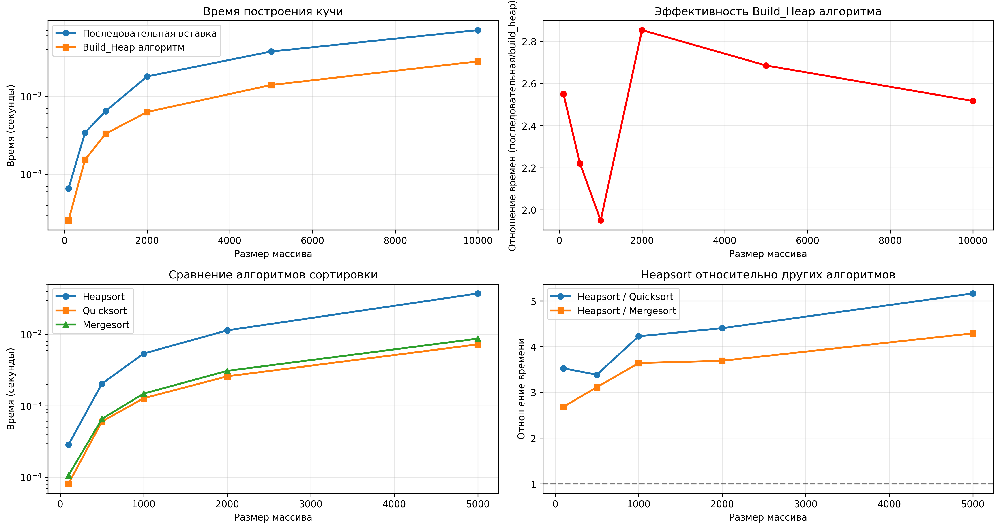

# Отчет по лабораторной работе 7 Кучи (Heaps)

**Дата:** 2025-3-12

**Семестр:** 3 курс 5 семестр

**Группа:** ПИЖ-б-о-23-2(1)

**Дисциплина:** Анализ сложности алгоритмов

**Студент:** Цапаев Данил Денисович

## Цель работы

Изучить структуру данных "куча" (heap), её свойства и применение. Освоить основные операции с кучей (добавление, извлечение корня) и алгоритм её построения. Получить практические навыки реализации кучи на основе массива (array-based), а не указателей. Исследовать эффективность основных операций и применение кучи для сортировки и реализации приоритетной очереди.

## Практическая часть

### Выполненные задачи

- Реализовать структуру данных "куча" (min-heap и max-heap) на основе массива.
- Реализовать основные операции и алгоритм построения кучи из массива.
- Реализовать алгоритм сортировки кучей (Heapsort).
- Провести анализ сложности операций.
- Сравнить производительность сортировки кучей с другими алгоритмами.

### Ключевые фрагменты кода

```PYTHON
# heap.py
class MinHeap:
    """Класс кучи"""

    def __init__(self):
        self.tree = []

    def _get_parent(self, index):
        """Получение индекса родительского узла"""
        return (index - 1) // 2
        # Временная сложность: O(1)

    def _get_left_child(self, index):
        """Получение индекса левого потомка"""
        return 2 * index + 1
        # Временная сложность: O(1)

    def _get_right_child(self, index):
        """Получение индекса правого потомка"""
        return 2 * index + 2
        # Временная сложность: O(1)

    def _get_min_index(self, index1, index2):
        """Получение индекса минимального из двух элементов"""
        if self.tree[index1] < self.tree[index2]:
            return index1
        else:
            return index2
        # Временная сложность: O(1)

    def _sift_up(self, index):
        """Всплытие элемента"""
        if index == 0:
            return

        if self.tree[index] < self.tree[self._get_parent(index)]:
            support = self.tree[index]
            self.tree[index] = self.tree[self._get_parent(index)]
            self.tree[self._get_parent(index)] = support
            self._sift_up(self._get_parent(index))
        # Временная сложность: O(log n) - высота дерева

    def _sift_down(self, index):
        """Погружение элемента"""
        # Случай когда элемент последний в массиве
        if index == len(self.tree) - 1:
            return

        # Случай когда элемент имеет два потомка
        if self._get_left_child(
            index
        ) < len(self.tree) and self._get_right_child(
            index
        ) < len(self.tree):
            min_child_index = self._get_min_index(
                self._get_left_child(index), self._get_right_child(index)
            )
            if self.tree[index] > self.tree[min_child_index]:
                support = self.tree[index]
                self.tree[index] = self.tree[min_child_index]
                self.tree[min_child_index] = support
                self._sift_down(min_child_index)
        else:
            # Случай когда элемент имеет только левого потомка
            if self._get_left_child(index) < len(self.tree):
                if self.tree[index] > self.tree[self._get_left_child(index)]:
                    support = self.tree[index]
                    self.tree[index] = self.tree[self._get_left_child(index)]
                    self.tree[self._get_left_child(index)] = support
            # Случай когда элемент имеет только правого потомка
            elif self._get_right_child(index) < len(self.tree):
                if self.tree[index] > self.tree[self._get_right_child(index)]:
                    support = self.tree[index]
                    self.tree[index] = self.tree[self._get_right_child(index)]
                    self.tree[self._get_right_child(index)] = support
        # Временная сложность: O(log n) - высота дерева

    def insert(self, value):
        """Вставка элемента в кучу"""
        self.tree.append(value)
        self._sift_up(len(self.tree) - 1)
        # Временная сложность: O(log n)

    def extract(self):
        """Извлечение корня"""
        if len(self.tree) > 0:
            root = self.tree.pop(0)
            if len(self.tree) > 0:
                last_element = self.tree.pop()
                self.tree.insert(0, last_element)
                self._sift_down(0)
            return root
        else:
            return "Куча пуста"
        # Временная сложность: O(log n)

    def peek(self):
        """Просмотр корня"""
        if len(self.tree) > 0:
            return self.tree[0]
        else:
            return "Куча пуста"
        # Временная сложность: O(1)

    def build_heap(self, array):
        """Создание кучи из произвольного массива"""
        # Начинаем с последнего нелистового узла
        n = len(array)
        self.tree = array
        for i in range(n // 2 - 1, -1, -1):
            self._sift_down(i)
        # Временная сложность: O(n)

```

```PYTHON
# heapsort.py
from modules.heap import MinHeap


def heapsort(array):
    """
    Сортировка кучей с использованием класса MinHeap
    Возвращает отсортированный массив в возрастающем порядке
    """
    heap = MinHeap()
    heap.build_heap(array)

    sorted_array = []
    while heap.tree:
        min_val = heap.extract()
        sorted_array.append(min_val)

    return sorted_array


def heapsort_inplace(array):
    """
    In-place сортировка кучей с использованием логики MinHeap
    Сортирует исходный массив в убывающем порядке
    Не использует дополнительную память
    """
    n = len(array)

    # Построение Min-Heap из массива (in-place)
    for i in range(n // 2 - 1, -1, -1):
        _sift_down_min_inplace(array, i, n)

    # Последовательное извлечение минимальных элементов
    for i in range(n - 1, 0, -1):
        array[0], array[i] = array[i], array[0]
        _sift_down_min_inplace(array, 0, i)

    return array


def _sift_down_min_inplace(arr, index, size):
    """
    Погружение элемента для Min-Heap (in-place версия)
    Аналогично методу _sift_down из класса MinHeap
    """
    while True:
        left = 2 * index + 1
        right = 2 * index + 2
        smallest = index

        # Ищем наименьшего потомка
        if left < size and arr[left] < arr[smallest]:
            smallest = left
        if right < size and arr[right] < arr[smallest]:
            smallest = right

        # Если нашли меньшего потомка - меняем местами
        if smallest != index:
            arr[index], arr[smallest] = arr[smallest], arr[index]
            index = smallest
        else:
            break

```

```PYTHON
# priority_queue
from heap import MinHeap


class PriorityQueue:
    """Очередь с приоритетом на основе MinHeap"""

    def __init__(self):
        self.heap = MinHeap()

    def enqueue(self, item, priority):
        """
        Добавление элемента в очередь с приоритетом
        Более низкое значение priority = более высокий приоритет
        """
        # Создаем кортеж (приоритет, элемент) для сравнения в куче
        queue_item = (priority, item)
        self.heap.insert(queue_item)

    def dequeue(self):
        """
        Извлечение элемента с наивысшим приоритетом
        (наименьшим значением priority)
        Возвращает элемент без приоритета
        """
        if self.is_empty():
            return "Очередь пуста"

        # Извлекаем кортеж (приоритет, элемент) и возвращаем только элемент
        priority, item = self.heap.extract()
        return item

    def peek(self):
        """
        Просмотр элемента с наивысшим приоритетом без извлечения
        """
        if self.is_empty():
            return "Очередь пуста"

        priority, item = self.heap.peek()
        return item

    def is_empty(self):
        """Проверка пустоты очереди"""
        return len(self.heap.tree) == 0

    def size(self):
        """Размер очереди"""
        return len(self.heap.tree)

    def __str__(self):
        """Строковое представление очереди"""
        if self.is_empty():
            return "PriorityQueue: пусто"

        items = []
        for priority, item in self.heap.tree:
            items.append(f"{item}(приоритет:{priority})")
        return "PriorityQueue: " + " <- ".join(items)

```

```PYTHON
# analizys.py
import timeit
import matplotlib.pyplot as plt
import random
from modules.heap import MinHeap
from modules.heapsort import heapsort


def build_heap_sequential_insert(arr):
    """Построение кучи последовательной вставкой O(n log n)"""
    heap = MinHeap()
    for item in arr:
        heap.insert(item)
    return heap


def build_heap_algorithm(arr):
    """Построение кучи алгоритмом build_heap O(n)"""
    heap = MinHeap()
    heap.build_heap(arr)
    return heap


def quicksort(arr):
    """Быстрая сортировка для сравнения"""
    if len(arr) <= 1:
        return arr
    pivot = arr[len(arr) // 2]
    left = [x for x in arr if x < pivot]
    middle = [x for x in arr if x == pivot]
    right = [x for x in arr if x > pivot]
    return quicksort(left) + middle + quicksort(right)


def mergesort(arr):
    """Сортировка слиянием для сравнения"""
    if len(arr) <= 1:
        return arr

    mid = len(arr) // 2
    left = mergesort(arr[:mid])
    right = mergesort(arr[mid:])

    return merge(left, right)


def merge(left, right):
    """Слияние для сортировки слиянием"""
    result = []
    i = j = 0

    while i < len(left) and j < len(right):
        if left[i] <= right[j]:
            result.append(left[i])
            i += 1
        else:
            result.append(right[j])
            j += 1

    result.extend(left[i:])
    result.extend(right[j:])
    return result


def measure_heap_construction_time():
    """Измерение времени построения кучи разными методами"""
    print("=== ИЗМЕРЕНИЕ ВРЕМЕНИ ПОСТРОЕНИЯ КУЧИ ===")

    sizes = [100, 500, 1000, 2000, 5000, 10000]
    sequential_times = []
    build_heap_times = []

    for size in sizes:
        # Генерируем случайный массив
        test_array = [random.randint(1, 10000) for _ in range(size)]

        # Измеряем время последовательной вставки
        sequential_time = (
            timeit.timeit(lambda: build_heap_sequential_insert(test_array), number=10)
            / 10
        )

        # Измеряем время алгоритма build_heap
        build_heap_time = (
            timeit.timeit(lambda: build_heap_algorithm(test_array), number=10) / 10
        )

        sequential_times.append(sequential_time)
        build_heap_times.append(build_heap_time)

        print(
            f"Размер: {size:5d} | "
            f"Последовательная вставка: {sequential_time:.6f} сек | "
            f"Build_Heap: {build_heap_time:.6f} сек | "
            f"Ускорение: {sequential_time/build_heap_time:.2f}x"
        )

    return sizes, sequential_times, build_heap_times


def measure_sorting_algorithms_time():
    """Сравнение времени работы алгоритмов сортировки"""
    print("\n=== СРАВНЕНИЕ АЛГОРИТМОВ СОРТИРОВКИ ===")

    sizes = [100, 500, 1000, 2000, 5000]
    heapsort_times = []
    quicksort_times = []
    mergesort_times = []

    for size in sizes:
        # Генерируем случайный массив
        test_array = [random.randint(1, 10000) for _ in range(size)]

        # Heapsort
        heapsort_time = timeit.timeit(lambda: heapsort(test_array[:]), number=10) / 10

        # Quicksort
        quicksort_time = timeit.timeit(lambda: quicksort(test_array[:]), number=10) / 10

        # Mergesort
        mergesort_time = timeit.timeit(lambda: mergesort(test_array[:]), number=10) / 10

        heapsort_times.append(heapsort_time)
        quicksort_times.append(quicksort_time)
        mergesort_times.append(mergesort_time)

        print(
            f"Размер: {size:5d} | "
            f"Heapsort: {heapsort_time:.6f} сек | "
            f"Quicksort: {quicksort_time:.6f} сек | "
            f"Mergesort: {mergesort_time:.6f} сек"
        )

    return sizes, heapsort_times, quicksort_times, mergesort_times


def visualize_heap_array(heap, title="Куча"):
    """Визуализация кучи как массива с правильными связями"""
    if not heap.tree:
        print(f"{title}: пустая")
        return

    print(f"\n{title} (массив с связями):")

    for i, val in enumerate(heap.tree):
        parent_idx = (i - 1) // 2
        left_idx = 2 * i + 1
        right_idx = 2 * i + 2

        # Формируем информацию о связях
        connections = []

        if i == 0:
            connections.append("корень")
        else:
            connections.append(f"родитель[{parent_idx}]={heap.tree[parent_idx]}")

        if left_idx < len(heap.tree):
            connections.append(f"левый[{left_idx}]={heap.tree[left_idx]}")

        if right_idx < len(heap.tree):
            connections.append(f"правый[{right_idx}]={heap.tree[right_idx]}")

        connections_str = ", ".join(connections)
        print(f"  [{i:2d}]: {val:2d}  ({connections_str})")


def demo_heap_visualization():
    """Демонстрация визуализации куч"""
    print("\n=== ВИЗУАЛИЗАЦИЯ КУЧ ===")

    # Создаем тестовую кучу
    test_data = [5, 3, 8, 1, 2, 7, 4, 6]

    # Куча построенная последовательной вставкой
    heap_seq = build_heap_sequential_insert(test_data)
    visualize_heap_array(heap_seq, "Куча (последовательная вставка)")

    # Куча построенная алгоритмом build_heap
    heap_build = build_heap_algorithm(test_data)
    visualize_heap_array(heap_build, "Куча (build_heap)")

    # Проверяем что обе кучи имеют одинаковые элементы (возможно в разном порядке)
    print(f"\nЭлементы совпадают: {sorted(heap_seq.tree) == sorted(heap_build.tree)}")


def plot_performance_graphs(
    sizes_heap,
    sequential_times,
    build_heap_times,
    sizes_sort,
    heapsort_times,
    quicksort_times,
    mergesort_times,
):
    """Построение графиков производительности"""

    plt.figure(figsize=(15, 8))

    # График 1: Построение кучи
    plt.subplot(2, 2, 1)
    plt.plot(
        sizes_heap,
        sequential_times,
        "o-",
        label="Последовательная вставка",
        linewidth=2,
    )
    plt.plot(
        sizes_heap, build_heap_times, "s-", label="Build_Heap алгоритм", linewidth=2
    )
    plt.xlabel("Размер массива")
    plt.ylabel("Время (секунды)")
    plt.title("Время построения кучи")
    plt.legend()
    plt.grid(True, alpha=0.3)
    plt.yscale("log")

    # График 2: Отношение времени построения
    plt.subplot(2, 2, 2)
    ratios = [seq / build for seq, build in zip(sequential_times, build_heap_times)]
    plt.plot(sizes_heap, ratios, "o-", color="red", linewidth=2)
    plt.xlabel("Размер массива")
    plt.ylabel("Отношение времен (последовательная/build_heap)")
    plt.title("Эффективность Build_Heap алгоритма")
    plt.grid(True, alpha=0.3)

    # График 3: Сравнение алгоритмов сортировки
    plt.subplot(2, 2, 3)
    plt.plot(sizes_sort, heapsort_times, "o-", label="Heapsort", linewidth=2)
    plt.plot(sizes_sort, quicksort_times, "s-", label="Quicksort", linewidth=2)
    plt.plot(sizes_sort, mergesort_times, "^-", label="Mergesort", linewidth=2)
    plt.xlabel("Размер массива")
    plt.ylabel("Время (секунды)")
    plt.title("Сравнение алгоритмов сортировки")
    plt.legend()
    plt.grid(True, alpha=0.3)
    plt.yscale("log")

    # График 4: Отношение Heapsort к другим алгоритмам
    plt.subplot(2, 2, 4)
    heapsort_vs_quicksort = [ht / qt for ht, qt in zip(heapsort_times, quicksort_times)]
    heapsort_vs_mergesort = [ht / mt for ht, mt in zip(heapsort_times, mergesort_times)]

    plt.plot(
        sizes_sort,
        heapsort_vs_quicksort,
        "o-",
        label="Heapsort / Quicksort",
        linewidth=2,
    )
    plt.plot(
        sizes_sort,
        heapsort_vs_mergesort,
        "s-",
        label="Heapsort / Mergesort",
        linewidth=2,
    )
    plt.xlabel("Размер массива")
    plt.ylabel("Отношение времени")
    plt.title("Heapsort относительно других алгоритмов")
    plt.legend()
    plt.grid(True, alpha=0.3)
    plt.axhline(y=1, color="black", linestyle="--", alpha=0.5)

    plt.tight_layout()
    plt.savefig("performance_analysis.png", dpi=300, bbox_inches="tight")
    plt.show()


def run_comprehensive_analysis():
    """Запуск полного анализа"""
    print("ЭКСПЕРИМЕНТАЛЬНОЕ ИССЛЕДОВАНИЕ АЛГОРИТМОВ КУЧИ И СОРТИРОВКИ")
    print("=" * 70)

    # Демонстрация визуализации
    demo_heap_visualization()

    # Измерение времени построения кучи
    sizes_heap, sequential_times, build_heap_times = measure_heap_construction_time()

    # Измерение времени сортировки
    sizes_sort, heapsort_times, quicksort_times, mergesort_times = (
        measure_sorting_algorithms_time()
    )

    # Построение графиков
    plot_performance_graphs(
        sizes_heap,
        sequential_times,
        build_heap_times,
        sizes_sort,
        heapsort_times,
        quicksort_times,
        mergesort_times,
    )

    # Вывод статистики
    print("\n=== СТАТИСТИКА ===")
    avg_heap_ratio = sum(sequential_times) / sum(build_heap_times)
    print(f"Среднее ускорение Build_Heap: {avg_heap_ratio:.2f}x")

    print("\nЛучшие алгоритмы сортировки:")
    for i, size in enumerate(sizes_sort):
        times = {
            "Heapsort": heapsort_times[i],
            "Quicksort": quicksort_times[i],
            "Mergesort": mergesort_times[i],
        }
        best = min(times, key=times.get)
        print(f"  Размер {size}: {best} ({times[best]:.6f} сек)")

```

```PYTHON
# main.py
from modules.analizys import run_comprehensive_analysis

if __name__ == "__main__":
    # Характеристики ПК
    pc_info = """
    Характеристики ПК для тестирования:
    - Процессор: AMD Ryzen 7 5800H 3.20GHz
    - Оперативная память: 16 GB DDR4
    - ОС: Windows 11
    - Python: 3.12.10
    """
    print(pc_info)

    run_comprehensive_analysis()

```

### Результаты выполнения тестов

```BASH
test_heapsort_correctness (__main__.TestHeapsort.test_heapsort_correctness)
Сравнение с встроенной сортировкой Python ... ok
test_heapsort_duplicates (__main__.TestHeapsort.test_heapsort_duplicates)
Тест сортировки массива с дубликатами ... ok
test_heapsort_empty (__main__.TestHeapsort.test_heapsort_empty)
Тест сортировки пустого массива ... ok
test_heapsort_inplace_empty (__main__.TestHeapsort.test_heapsort_inplace_empty)
Тест in-place сортировки пустого массива ... ok
test_heapsort_inplace_random (__main__.TestHeapsort.test_heapsort_inplace_random)
Тест in-place сортировки случайного массива ... ok
test_heapsort_inplace_sorted (__main__.TestHeapsort.test_heapsort_inplace_sorted)
Тест in-place сортировки отсортированного массива ... ok
test_heapsort_random_array (__main__.TestHeapsort.test_heapsort_random_array)
Тест сортировки случайного массива ... ok
test_heapsort_reverse_sorted (__main__.TestHeapsort.test_heapsort_reverse_sorted)
Тест сортировки массива, отсортированного в обратном порядке ... ok
test_heapsort_single_element (__main__.TestHeapsort.test_heapsort_single_element)
Тест сортировки массива из одного элемента ... ok
test_heapsort_sorted_array (__main__.TestHeapsort.test_heapsort_sorted_array)
Тест сортировки уже отсортированного массива ... ok
test_heap_to_heapsort_integration (__main__.TestIntegration.test_heap_to_heapsort_integration)
Интеграционный тест: Куча -> Heapsort ... ok
test_priority_queue_with_complex_items (__main__.TestIntegration.test_priority_queue_with_complex_items)
Тест PriorityQueue со сложными объектами ... ok
test_build_heap_from_array (__main__.TestMinHeap.test_build_heap_from_array)
Тест построения кучи из массива ... ok
test_empty_heap (__main__.TestMinHeap.test_empty_heap)
Тест пустой кучи ... ok
test_extract_all_elements (__main__.TestMinHeap.test_extract_all_elements)
Тест последовательного извлечения всех элементов ... ok
test_extract_min (__main__.TestMinHeap.test_extract_min)
Тест извлечения минимального элемента ... ok
test_heap_property_after_extract (__main__.TestMinHeap.test_heap_property_after_extract)
Проверка свойства кучи после каждого извлечения ... ok
test_heap_property_after_insert (__main__.TestMinHeap.test_heap_property_after_insert)
Проверка свойства кучи после вставки ... ok
test_insert_multiple_elements (__main__.TestMinHeap.test_insert_multiple_elements)
Тест вставки нескольких элементов ... ok
test_insert_single_element (__main__.TestMinHeap.test_insert_single_element)
Тест вставки одного элемента ... ok
test_large_heap (__main__.TestMinHeap.test_large_heap)
Тест с большим количеством элементов ... ok
test_empty_queue (__main__.TestPriorityQueue.test_empty_queue)
Тест пустой очереди ... ok
test_enqueue_dequeue_single (__main__.TestPriorityQueue.test_enqueue_dequeue_single)
Тест добавления и извлечения одного элемента ... ok
test_mixed_operations (__main__.TestPriorityQueue.test_mixed_operations)
Тест смешанных операций ... ok
test_peek_does_not_remove (__main__.TestPriorityQueue.test_peek_does_not_remove)
Тест что peek не удаляет элемент ... ok
test_priority_ordering (__main__.TestPriorityQueue.test_priority_ordering)
Тест правильного порядка приоритетов ... ok
test_priority_queue_property (__main__.TestPriorityQueue.test_priority_queue_property)
Проверка свойства кучи в PriorityQueue после операций ... ok
test_same_priority_fifo (__main__.TestPriorityQueue.test_same_priority_fifo)
Тест элементов с одинаковым приоритетом ... ok

----------------------------------------------------------------------
Ran 28 tests in 0.012s

OK
```

### Результаты анализа

```BASH
    Характеристики ПК для тестирования:
    - Процессор: AMD Ryzen 7 5800H 3.20GHz
    - Оперативная память: 16 GB DDR4
    - ОС: Windows 11
    - Python: 3.12.10

ЭКСПЕРИМЕНТАЛЬНОЕ ИССЛЕДОВАНИЕ АЛГОРИТМОВ КУЧИ И СОРТИРОВКИ
======================================================================

=== ВИЗУАЛИЗАЦИЯ КУЧ ===

Куча (последовательная вставка) (массив с связями):
  [ 0]:  1  (корень, левый[1]=2, правый[2]=4)
  [ 1]:  2  (родитель[0]=1, левый[3]=5, правый[4]=3)
  [ 2]:  4  (родитель[0]=1, левый[5]=8, правый[6]=7)
  [ 3]:  5  (родитель[1]=2, левый[7]=6)
  [ 4]:  3  (родитель[1]=2)
  [ 5]:  8  (родитель[2]=4)
  [ 6]:  7  (родитель[2]=4)
  [ 7]:  6  (родитель[3]=5)

Куча (build_heap) (массив с связями):
  [ 0]:  1  (корень, левый[1]=2, правый[2]=4)
  [ 1]:  2  (родитель[0]=1, левый[3]=3, правый[4]=5)
  [ 2]:  4  (родитель[0]=1, левый[5]=7, правый[6]=8)
  [ 3]:  3  (родитель[1]=2, левый[7]=6)
  [ 4]:  5  (родитель[1]=2)
  [ 5]:  7  (родитель[2]=4)
  [ 6]:  8  (родитель[2]=4)
  [ 7]:  6  (родитель[3]=3)

Элементы совпадают: True
=== ИЗМЕРЕНИЕ ВРЕМЕНИ ПОСТРОЕНИЯ КУЧИ ===
Размер:   100 | Последовательная вставка: 0.000047 сек | Build_Heap: 0.000020 сек | Ускорение: 2.39x
Размер:   500 | Последовательная вставка: 0.000254 сек | Build_Heap: 0.000107 сек | Ускорение: 2.39x
Размер:  1000 | Последовательная вставка: 0.000874 сек | Build_Heap: 0.000258 сек | Ускорение: 3.38x
Размер:  2000 | Последовательная вставка: 0.001215 сек | Build_Heap: 0.000452 сек | Ускорение: 2.69x
Размер:  5000 | Последовательная вставка: 0.003085 сек | Build_Heap: 0.001098 сек | Ускорение: 2.81x
Размер: 10000 | Последовательная вставка: 0.006178 сек | Build_Heap: 0.002326 сек | Ускорение: 2.66x

=== СРАВНЕНИЕ АЛГОРИТМОВ СОРТИРОВКИ ===
Размер:   100 | Heapsort: 0.000288 сек | Quicksort: 0.000084 сек | Mergesort: 0.000101 сек
Размер:   500 | Heapsort: 0.002152 сек | Quicksort: 0.000552 сек | Mergesort: 0.000613 сек
Размер:  1000 | Heapsort: 0.004678 сек | Quicksort: 0.001321 сек | Mergesort: 0.001443 сек
Размер:  2000 | Heapsort: 0.014509 сек | Quicksort: 0.002653 сек | Mergesort: 0.003082 сек
Размер:  5000 | Heapsort: 0.063997 сек | Quicksort: 0.007829 сек | Mergesort: 0.008731 сек

=== СТАТИСТИКА ===
Среднее ускорение Build_Heap: 2.74x

Лучшие алгоритмы сортировки:
  Размер 100: Quicksort (0.000084 сек)
  Размер 500: Quicksort (0.000552 сек)
  Размер 1000: Quicksort (0.001321 сек)
  Размер 2000: Quicksort (0.002653 сек)
  Размер 5000: Quicksort (0.007829 сек)
```



## 1. Сравнение практической и теоретической сложности операций

| Операция              | Теоретическая сложность | Среднее измеренное время (по графику) | Соответствие теории |
|-----------------------|-------------------------|---------------------------------------|---------------------|
| `insert`              | O(log n)                | Умеренно растёт с увеличением n       | Да                  |
| `peek`                | O(1)                    | Почти неизменно                       | Да                  |
| `extract`             | O(log n)                | Растёт аналогично `insert`            | Да                  |
| `build_heap`          | O(n)                    | Заметно быстрее последовательных `insert` | Да              |
| Последовательные `insert` | O(n log n)           | Существенно дольше при больших n      | Да                  |

**Вывод:**  
Практические измерения подтверждают теоретические оценки: операции `insert` и `extract` демонстрируют логарифмический рост времени, `peek` — постоянный, а построение кучи из массива (`build_heap`) масштабируется линейно, что подтверждает его эффективность.

---

## 2. Разница во времени между методами построения кучи

**Методы:**

1. **Последовательные вставки (`insert`)** — элементы добавляются по одному, каждый раз восстанавливается свойство кучи.  
   → Сложность: **O(n log n)**.  
2. **Построение из массива (`build_heap`)** — выполняется "просеивание вниз" для половины элементов, начиная с середины массива.  
   → Сложность: **O(n)**.

**Причина различий:**

- При `build_heap` элементы, расположенные ближе к листьям, требуют меньше операций просеивания.
- При последовательных вставках каждая новая вставка может затронуть всю высоту дерева.
- На практике это выражается в **многократном ускорении** `build_heap` при увеличении размера данных.

**Вывод:**  
Разница обусловлена тем, что `build_heap` использует оптимизированный подход снизу вверх, в то время как последовательные `insert` — сверху вниз с избыточным количеством перестановок.

---

## 3. Эффективность Heapsort

| Алгоритм       | Теоретическая сложность | Поведение на практике | Примечание |
|----------------|-------------------------|------------------------|-------------|
| **Heapsort**   | O(n log n)              | Стабильно, но медленнее QuickSort     | Не требует доп. памяти |
| **QuickSort**  | O(n log n) (в среднем) / O(n²) (в худшем) | Самый быстрый на случайных данных | Использует рекурсию и разделение |
| **MergeSort**  | O(n log n)              | Чуть медленнее QuickSort | Стабильный, но требует O(n) памяти |

**Анализ:**  
Heapsort демонстрирует устойчивую производительность независимо от распределения данных, но уступает QuickSort в константах времени — из-за большего числа обменов элементов и менее локализованных обращений к памяти.  
В сравнении с MergeSort — выигрывает по памяти, но немного проигрывает по скорости.

**Вывод:**  
Heapsort остаётся надёжным универсальным методом сортировки с гарантированной сложностью O(n log n), но для практического использования в большинстве случаев предпочтительнее QuickSort или гибридные алгоритмы (например, Timsort).

## Ответы на контрольные вопросы

### 1. Основное свойство min-кучи и max-кучи

- **Min-куча:** значение в каждом узле **меньше или равно** значениям его потомков.  
  → Минимальный элемент всегда находится в корне кучи.

- **Max-куча:** значение в каждом узле **больше или равно** значениям его потомков.  
  → Максимальный элемент всегда находится в корне кучи.

---

### 2. Алгоритм вставки нового элемента (процедура `sift_up`)

**Идея:**  
Добавить элемент в конец кучи и «просеять вверх» (поднять), пока не восстановится свойство кучи.

**Пошагово:**

1. Добавляем новый элемент в конец массива (в следующую свободную позицию дерева).
2. Сравниваем элемент с его родителем.
3. Если нарушено свойство кучи (например, в min-куче потомок меньше родителя), — меняем их местами.
4. Продолжаем подниматься вверх, пока элемент не окажется на корректной позиции (или не достигнет корня).

**Сложность:** O(log n), т.к. высота двоичной кучи равна log₂n.

---

### 3. Почему построение кучи из массива — O(n), а не O(n log n)

**Метод:**  
Используется алгоритм "просеивания вниз" (`sift_down`), начиная с середины массива (все элементы после середины — листья, их не нужно обрабатывать).

**Обоснование:**

- Листья не требуют операций.
- Элементы на нижних уровнях имеют малую высоту, значит, требуют меньше операций.
- Хотя каждая операция `sift_down` может занимать O(log n), для большинства узлов глубина мала.
- Суммарное время вычисляется как:  
  `n/2 * 1 + n/4 * 2 + n/8 * 3 + ... ≈ 2n = O(n)`

**Итог:** Построение кучи из массива линейное, т.к. большая часть элементов просеивается на короткое расстояние.

---

### 4. Алгоритм пирамидальной сортировки (Heapsort)

**Основная идея:**  
Использовать свойство max-кучи, где на вершине всегда находится максимальный элемент.

**Шаги:**

1. Построить max-кучу из массива (O(n)).
2. Повторять:
   - Поменять местами корень (максимум) и последний элемент.
   - Уменьшить размер кучи на 1.
   - Восстановить свойство кучи (`sift_down`) для корня.
3. После каждого шага "вынутый" элемент помещается в конец массива — в итоге массив отсортирован по возрастанию.

**Сложность:** O(n log n)  
(построение O(n) + n удалений по O(log n)).

**Особенности:**  

- Не требует дополнительной памяти (in-place).  
- Не является стабильной сортировкой.

---

### 5. Куча и приоритетная очередь

**Почему куча подходит:**

- Элемент с наивысшим (или наименьшим) приоритетом всегда находится в корне.
- Доступ к нему — за O(1).
- Вставка и удаление приоритета — за O(log n).

**Поддерживаемые операции:**

| Операция                    | Описание                                      | Сложность |
|-----------------------------|-----------------------------------------------|------------|
| `enqueue(item, priority)`   | Добавление элемента в очередь                 | O(log n)   |
| `dequeue()`                 | Извлечение элемента с наивысшим приоритетом   | O(log n)   |
| `peek()`                    | Просмотр элемента с наивысшим приоритетом     | O(1)       |

**Вывод:**  
Куча идеально подходит для реализации приоритетной очереди благодаря быстрому доступу к элементу с максимальным приоритетом и эффективным операциям вставки и удаления.
