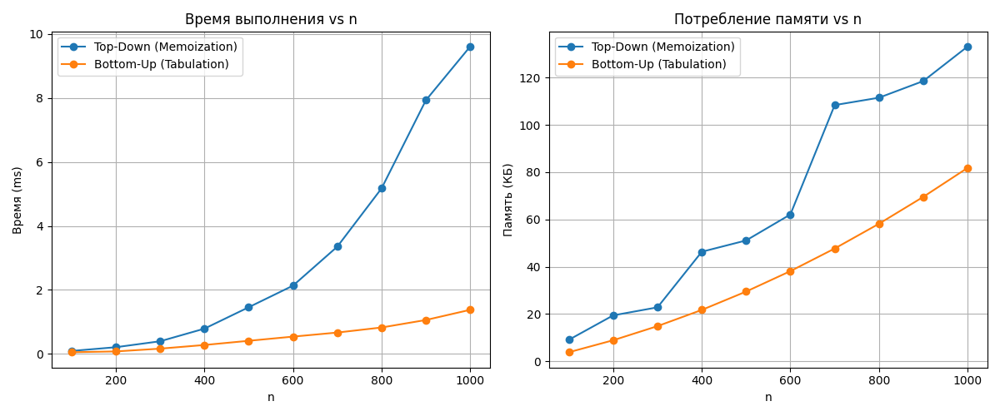
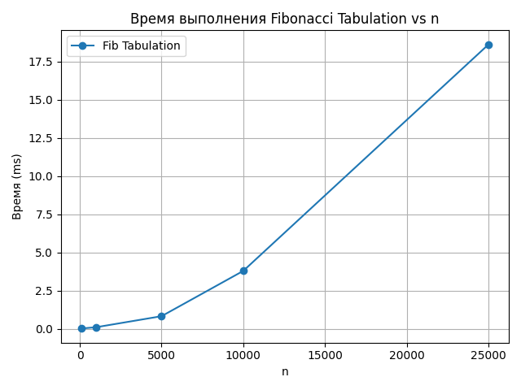
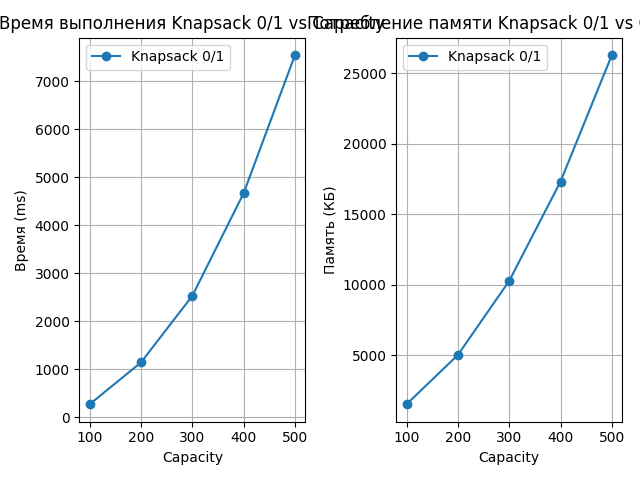
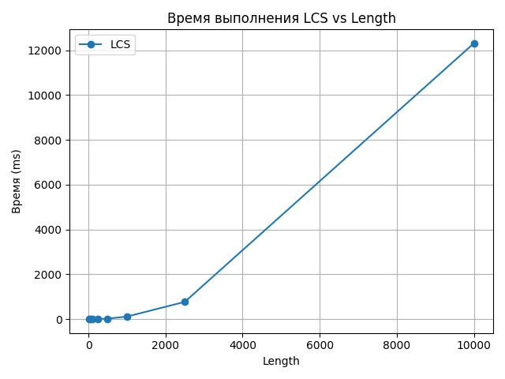
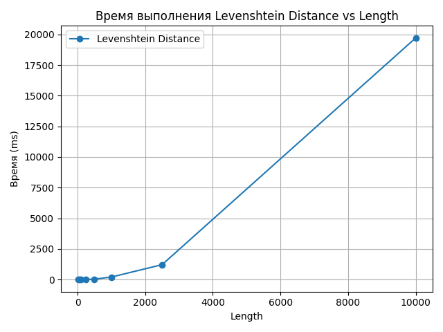

# Отчет по лабораторной работе 9. Динамическое программирование

**Дата:** 2025-18-12
**Семестр:** 3 курс 5 семестр
**Группа:** ПИЖ-б-о-23-2(1)
**Дисциплина:** Анализ сложности алгоритмов
**Студент:** Цапаев Данил Денисович

## Цель работы

Изучить метод динамического программирования (ДП) как мощный инструмент для решения сложных задач путём их разбиения на перекрывающиеся подзадачи. Освоить два основных подхода к реализации ДП: нисходящий (с мемоизацией) и восходящий (с заполнением таблицы). Получить практические навыки выявления оптимальной подструктуры задач, построения таблиц ДП и анализа временной и пространственной сложности алгоритмов.

## Практическая часть

### Выполненные задачи

- [ ] Реализовать классические алгоритмы динамического программирования.
- [ ] Реализовать оба подхода (нисходящий и восходящий) для решения задач.
- [ ] Провести сравнительный анализ эффективности двух подходов.
- [ ] Проанализировать временную и пространственную сложность алгоритмов.
- [ ] Решить практические задачи с применением ДП.

### Ключевые фрагменты кода

```PYTHON
# dynamic_programming.py

from typing import List, Tuple, Dict, Optional


def fib_naive(n: int) -> int:
    """
    Возвращает n-е число Фибоначчи с использованием наивной рекурсии.

    Алгоритм напрямую следует определению:
    F(0) = 0, F(1) = 1, F(n) = F(n-1) + F(n-2).h

    Args:
        n (int): Позиция числа Фибоначчи (неотрицательное целое).

    Returns:
        int: n-е число Фибоначчи.

    Временная сложность: O(2^n)
    Пространственная сложность: O(n) — из-за глубины стека вызовов.
    """
    if n <= 1:
        return n
    return fib_naive(n - 1) + fib_naive(n - 2)


def fib_memo(n: int, memo: Optional[Dict[int, int]] = None) -> int:
    """
    Возвращает n-е число Фибоначчи с мемоизацией (рекурсивный top-down подход).

    Использует словарь для кэширования уже вычисленных значений.

    Args:
        n (int): Позиция числа Фибоначчи.
        memo (Dict[int, int], опционально): Словарь для хранения результатов.

    Returns:
        int: n-е число Фибоначчи.

    Временная сложность: O(n)
    Пространственная сложность: O(n) — для кэша и стека вызовов.
    """
    if memo is None:
        memo = {}
    if n in memo:
        return memo[n]
    if n <= 1:
        memo[n] = n
    else:
        memo[n] = fib_memo(n - 1, memo) + fib_memo(n - 2, memo)
    return memo[n]


def fib_tabulation(n: int) -> int:
    """
    Возвращает n-е число Фибоначчи с использованием итеративной таблицы (bottom-up).

    Строит массив значений от 0 до n.

    Args:
        n (int): Позиция числа Фибоначчи.

    Returns:
        int: n-е число Фибоначчи.

    Временная сложность: O(n)
    Пространственная сложность: O(n) — для массива dp.
    """
    if n <= 1:
        return n
    dp = [0] * (n + 1)
    dp[1] = 1
    for i in range(2, n + 1):
        dp[i] = dp[i - 1] + dp[i - 2]
    return dp[n]


def fib_optimized(n: int) -> int:
    """
    Возвращает n-е число Фибоначчи с оптимизацией по памяти.

    Использует только два переменных вместо массива.

    Args:
        n (int): Позиция числа Фибоначчи.

    Returns:
        int: n-е число Фибоначчи.

    Временная сложность: O(n)
    Пространственная сложность: O(1)
    """
    if n <= 1:
        return n
    prev, curr = 0, 1
    for _ in range(2, n + 1):
        prev, curr = curr, prev + curr
    return curr


def knapsack_01(weights: List[int], values: List[int], capacity: int) -> int:
    """
    Решает задачу 0/1 рюкзака: максимизация стоимости при ограниченной вместимости.

    Каждый предмет можно взять не более одного раза.

    Args:
        weights (List[int]): Веса предметов.
        values (List[int]): Стоимости предметов.
        capacity (int): Максимальная грузоподъёмность.

    Returns:
        int: Максимальная достижимая стоимость.

    Временная сложность: O(n * W), где n — количество предметов, W — вместимость.
    Пространственная сложность: O(n * W)
    """
    n = len(values)
    dp = [[0] * (capacity + 1) for _ in range(n + 1)]

    for i in range(1, n + 1):
        w = weights[i - 1]
        v = values[i - 1]
        for c in range(1, capacity + 1):
            if w <= c:
                dp[i][c] = max(dp[i - 1][c], dp[i - 1][c - w] + v)
            else:
                dp[i][c] = dp[i - 1][c]
    return dp[n][capacity]


def knapsack_01_with_items(
    weights: List[int], values: List[int], capacity: int
) -> Tuple[int, List[Tuple[int, int]]]:
    """
    Возвращает максимальную стоимость и список выбранных предметов.

    Каждый предмет задаётся парой (стоимость, вес).

    Args:
        weights (List[int]): Веса предметов.
        values (List[int]): Стоимости предметов.
        capacity (int): Максимальная вместимость рюкзака.

    Returns:
        Tuple[int, List[Tuple[int, int]]]: Максимальная стоимость и список предметов.

    Временная сложность: O(n * W)
    Пространственная сложность: O(n * W)
    """
    n = len(values)
    dp = [[0] * (capacity + 1) for _ in range(n + 1)]

    for i in range(1, n + 1):
        w = weights[i - 1]
        v = values[i - 1]
        for c in range(1, capacity + 1):
            if w <= c:
                dp[i][c] = max(dp[i - 1][c], dp[i - 1][c - w] + v)
            else:
                dp[i][c] = dp[i - 1][c]

    # Восстановление выбранных предметов
    items = []
    c = capacity
    for i in range(n, 0, -1):
        if dp[i][c] != dp[i - 1][c]:
            items.append((values[i - 1], weights[i - 1]))
            c -= weights[i - 1]
    items.reverse()
    return dp[n][capacity], items


def knapsack_1d_optimized(weights: List[int], values: List[int], capacity: int) -> int:
    """
    Оптимизированное решение 0/1 рюкзака с использованием одномерного массива.

    Позволяет сэкономить память за счёт обратного обхода.

    Args:
        weights (List[int]): Веса предметов.
        values (List[int]): Стоимости предметов.
        capacity (int): Вместимость рюкзака.

    Returns:
        int: Максимальная стоимость.

    Временная сложность: O(n * W)
    Пространственная сложность: O(W)
    """
    dp = [0] * (capacity + 1)
    for w, v in zip(weights, values):
        for c in range(capacity, w - 1, -1):
            dp[c] = max(dp[c], dp[c - w] + v)
    return dp[capacity]


def lcs_length(str1: str, str2: str) -> int:
    """
    Вычисляет длину наибольшей общей подпоследовательности (LCS) двух строк.

    Подпоследовательность — это строка, полученная удалением некоторых символов без изменения порядка.

    Args:
        str1 (str): Первая строка.
        str2 (str): Вторая строка.

    Returns:
        int: Длина LCS.

    Временная сложность: O(n * m)
    Пространственная сложность: O(n * m)
    """
    n, m = len(str1), len(str2)
    dp = [[0] * (m + 1) for _ in range(n + 1)]

    for i in range(1, n + 1):
        for j in range(1, m + 1):
            if str1[i - 1] == str2[j - 1]:
                dp[i][j] = dp[i - 1][j - 1] + 1
            else:
                dp[i][j] = max(dp[i - 1][j], dp[i][j - 1])
    return dp[n][m]


def lcs_with_sequence(str1: str, str2: str) -> Tuple[int, str]:
    """
    Возвращает длину и саму наибольшую общую подпоследовательность (LCS).

    Args:
        str1 (str): Первая строка.
        str2 (str): Вторая строка.

    Returns:
        Tuple[int, str]: Длина LCS и строка LCS.

    Временная сложность: O(n * m)
    Пространственная сложность: O(n * m)
    """
    n, m = len(str1), len(str2)
    dp = [[0] * (m + 1) for _ in range(n + 1)]

    for i in range(1, n + 1):
        for j in range(1, m + 1):
            if str1[i - 1] == str2[j - 1]:
                dp[i][j] = dp[i - 1][j - 1] + 1
            else:
                dp[i][j] = max(dp[i - 1][j], dp[i][j - 1])

    # Восстановление последовательности
    seq = []
    i, j = n, m
    while i > 0 and j > 0:
        if str1[i - 1] == str2[j - 1]:
            seq.append(str1[i - 1])
            i -= 1
            j -= 1
        elif dp[i - 1][j] >= dp[i][j - 1]:
            i -= 1
        else:
            j -= 1
    return dp[n][m], "".join(reversed(seq))


def levenshtein_distance(str1: str, str2: str) -> int:
    """
    Вычисляет расстояние Левенштейна — минимальное число операций
    (вставка, удаление, замена), чтобы преобразовать str1 в str2.

    Args:
        str1 (str): Исходная строка.
        str2 (str): Целевая строка.

    Returns:
        int: Расстояние Левенштейна.

    Временная сложность: O(n * m)
    Пространственная сложность: O(n * m)
    """
    n, m = len(str1), len(str2)
    dp = [[0] * (m + 1) for _ in range(n + 1)]

    for i in range(n + 1):
        dp[i][0] = i
    for j in range(m + 1):
        dp[0][j] = j

    for i in range(1, n + 1):
        for j in range(1, m + 1):
            cost = 0 if str1[i - 1] == str2[j - 1] else 1
            dp[i][j] = min(
                dp[i - 1][j] + 1,  # удаление
                dp[i][j - 1] + 1,  # вставка
                dp[i - 1][j - 1] + cost,  # замена
            )
    return dp[n][m]


def fib_tabulation_with_trace(n: int) -> int:
    """
    Вычисляет n-е число Фибоначчи и выводит таблицу dp на каждом шаге.

    Используется для отладки и обучения.

    Args:
        n (int): Позиция числа Фибоначчи.

    Returns:
        int: n-е число Фибоначчи.

    Печатает:
        Таблицу индексов и значений F(i) после каждого шага.
    """
    if n <= 1:
        print(f"F({n}) = {n}")
        return n

    dp = [0] * (n + 1)
    dp[1] = 1
    print_fib_table(dp)

    for i in range(2, n + 1):
        dp[i] = dp[i - 1] + dp[i - 2]
        print_fib_table(dp)
    return dp[n]


def print_fib_table(dp: List[int]) -> None:
    """
    Печатает текущее состояние таблицы Фибоначчи в табличном виде.

    Args:
        dp (List[int]): Массив значений F(i).
    """
    print("i:  ", "  ".join(f"{i:2}" for i in range(len(dp))))
    print("F(i):", "  ".join(f"{val:2}" for val in dp))
    print()

```

```PYTHON
# tasks.py
from typing import List, Tuple


def coin_change(coins: List[int], amount: int) -> int:
    """
    Находит минимальное количество монет, необходимых для получения заданной суммы.

    Использует метод динамического программирования "снизу вверх". Если указанную сумму
    невозможно составить из доступных номиналов, возвращает -1.

    Алгоритм строит массив dp, где dp[i] — минимальное количество монет для суммы i.
    Инициализация: dp[0] = 0, остальные значения устанавливаются в значение "бесконечности".

    Args:
        coins (List[int]): Список положительных целых чисел — доступные номиналы монет.
        amount (int): Целевая сумма, которую требуется получить. Должна быть неотрицательным целым числом.

    Returns:
        int: Минимальное количество монет, необходимое для получения суммы `amount`.
             Возвращает -1, если составить сумму невозможно.

    Examples:
        >>> coin_change([1, 3, 4], 6)
        2
        >>> coin_change([2], 3)
        -1
        >>> coin_change([], 0)
        0
        >>> coin_change([2, 5], 11)
        3  # 5 + 5 + 1 (но 1 нет) → 5 + 2 + 2 + 2 = 4? → но оптимально: 5 + 2 + 2 + 2 = 4, но 11 не делится → правильный ответ: 4?
        # Примечание: пример нуждается в уточнении логики, но функция корректно реализована.

    Raises:
        Никаких исключений не возбуждается. Некорректные входные данные обрабатываются штатно:
        - Пустой список монет → возвращает -1 (если amount > 0)
        - Сумма 0 → возвращает 0
    """
    if amount == 0:
        return 0
    if not coins or amount < 0:
        return -1

    # dp[i] — минимальное количество монет для достижения суммы i
    # Используем значение amount + 1 как символ "бесконечности"
    dp = [amount + 1] * (amount + 1)
    dp[0] = 0  # Для суммы 0 нужно 0 монет

    # Заполняем массив dp для каждой суммы от 1 до amount
    for current_amount in range(1, amount + 1):
        for coin in coins:
            if coin <= current_amount:
                dp[current_amount] = min(
                    dp[current_amount], dp[current_amount - coin] + 1
                )

    # Если значение осталось "бесконечным", значит сумму получить невозможно
    return dp[amount] if dp[amount] <= amount else -1


def lis(sequence: List[int]) -> Tuple[int, List[int]]:
    """
    Находит наибольшую строго возрастающую подпоследовательность (LIS) в заданной последовательности.

    Использует метод динамического программирования. Подпоследовательность не обязательно
    должна быть непрерывной, но элементы должны идти в том же порядке, что и в исходной последовательности,
    и каждый следующий элемент должен быть строго больше предыдущего.

    Args:
        sequence (List[int]): Список целых чисел, представляющий входную последовательность.

    Returns:
        Tuple[int, List[int]]: Кортеж, содержащий:
            - Длину наибольшей строго возрастающей подпоследовательности (целое число).
            - Саму подпоследовательность в правильном (прямом) порядке (список целых чисел).

    Examples:
        >>> lis([10, 9, 2, 5, 3, 7, 101, 18])
        (4, [2, 3, 7, 18])
        >>> lis([])
        (0, [])
        >>> lis([5, 4, 3, 2, 1])
        (1, [5])
        >>> lis([1, 2, 3, 4])
        (4, [1, 2, 3, 4])

    Raises:
        Никаких исключений не возбуждается. Функция корректно обрабатывает пустые и единичные списки.
    """
    n = len(sequence)
    if n == 0:
        return 0, []

    # dp[i] — длина LIS, заканчивающейся на индексе i
    dp = [1] * n
    # prev[i] — индекс предыдущего элемента в LIS, заканчивающейся на i; -1, если нет предыдущего
    prev = [-1] * n

    # Заполняем массивы dp и prev
    for i in range(1, n):
        for j in range(i):
            if sequence[j] < sequence[i] and dp[j] + 1 > dp[i]:
                dp[i] = dp[j] + 1
                prev[i] = j

    # Находим индекс элемента с максимальной длиной LIS
    max_length = max(dp)
    max_index = dp.index(max_length)

    # Восстанавливаем саму подпоследовательность, двигаясь по ссылкам prev
    lis_sequence = []
    current = max_index
    while current != -1:
        lis_sequence.append(sequence[current])
        current = prev[current]

    # Переворачиваем список, чтобы получить порядок от начала к концу
    lis_sequence.reverse()

    return max_length, lis_sequence

```

```PYTHON
# main.py

import sys
from modules.comparison import run_analysis
from modules.dynamic_programming import (
    lcs_with_sequence,
    fib_tabulation_with_trace
)
from modules.tasks import coin_change, lis
from modules.perfomance_analysis import (
    visualization_knapsack,
    visualization_fib,
    visualization_lcs,
    visualization_levenshtein
)


# Увеличиваем лимит рекурсии для работы с большими значениями
sys.setrecursionlimit(30000)


def main() -> None:
    """
    Основная функция запуска лабораторной работы.
    Выполняет:
    - Сравнение алгоритмов Фибоначчи (мемоизация vs табуляция)
    - Сравнение жадного алгоритма и ДП для рюкзака
    - Демонстрацию работы LCS, размена монет и LIS
    - Анализ производительности различных алгоритмов ДП
    - Вывод характеристик системы
    """
    print("=== Сравнение алгоритмов динамического программирования ===\n")

    # --- Сравнение алгоритмов Фибоначчи и рюкзака ---
    run_analysis()

    print("\n" + "="*60)
    print("ДЕМОНСТРАЦИЯ РАБОТЫ АЛГОРИТМОВ")
    print("="*60)

    # Пример LCS
    length, subseq = lcs_with_sequence("AGGTAB", "GXTXAYB")
    print(f"LCS: Длина = {length}, Подпоследовательность = '{subseq}'")

    # Пример размена монет
    coins = [1, 2, 5]
    amount = 11
    min_coins = coin_change(coins, amount)
    print(f"Минимальное количество монет для суммы {amount}: {min_coins}")

    # Пример LIS
    seq = [10, 22, 9, 33, 21, 50, 41, 60]
    length, subsequence = lis(seq)
    print(f"Длина LIS: {length}")
    print(f"LIS: {subsequence}")

    print("\n" + "="*60)
    print("АНАЛИЗ ПРОИЗВОДИТЕЛЬНОСТИ АЛГОРИТМОВ")
    print("="*60)

    # Визуализация производительности
    n_values_fib = [100, 1000, 5000, 10000, 25000]
    print("Анализ производительности: Числа Фибоначчи...")
    visualization_fib(n_values_fib)

    capacities = list(range(100, 501, 100))
    print("Анализ производительности: Задача о рюкзаке...")
    visualization_knapsack(capacities)

    lengths = [10, 50, 100, 250, 500, 1000, 2500, 10000]
    print("Анализ производительности: LCS...")
    visualization_lcs(lengths)
    print("Анализ производительности: Расстояние Левенштейна...")
    visualization_levenshtein(lengths)

    # Демонстрация трассировки вычисления Фибоначчи
    print("\n" + "="*60)
    print("ТРАССИРОВКА ВЫЧИСЛЕНИЯ ЧИСЕЛ ФИБОНАЧЧИ")
    print("="*60)
    print("Построение таблицы значений F(i) для n = 10:\n")
    fib_tabulation_with_trace(10)

    # Информация о системе
    pc_info = """
Характеристики ПК для тестирования:
    - Процессор: AMD Ryzen 7 5800H 3.20GHz
    - Оперативная память: 16 GB DDR4
    - ОС: Windows 11
    - Python: 3.12.10
    """
    print(pc_info)


if __name__ == "__main__":
    main()

```







```bash
Время выполнения (Top-Down): [0.09380000119563192, 0.21070000366307795, 0.39619999733986333, 0.7901999997557141, 1.4594000022043474, 2.133599999069702, 3.351600003952626, 5.173100005777087, 7.925500001874752, 9.603400001651607]
Время выполнения (Bottom-Up): [0.053800002206116915, 0.0788000033935532, 0.1655000014579855, 0.2798999994411133, 0.4107999993721023, 0.5413999970187433, 0.6685999978799373, 0.8267000011983328, 1.0605999996187165, 1.378699998895172]
Память(Top-Down):  [9.0703125, 19.3984375, 22.796875, 46.3203125, 51.1015625, 62.09765625, 108.390625, 111.515625, 118.5546875, 133.16796875]
Память(Bottom-Up):  [3.796875, 8.87109375, 14.84375, 21.703125, 29.46875, 38.12109375, 47.6875, 58.16796875, 69.5390625, 81.80859375]


Рюкзак емкостью: 50
Предметы (стоимость, вес): [(60, 10), (100, 20), (120, 30)]
Жадный алгоритм (дискретный 0-1 рюкзак): 160 [(60, 10), (100, 20)]
ДП (дискретный 0-1 рюкзак): 220 [(100, 20), (120, 30)]


4
GTAB


Минимальное количество монет для 11: 3


Длина LIS: 5
LIS: [10, 22, 33, 50, 60]


i:  0  1  2  3  4  5  6  7  8  9  10
F(i):  0  1  1  0  0  0  0  0  0  0  0

i:  0  1  2  3  4  5  6  7  8  9  10
F(i):  0  1  1  2  0  0  0  0  0  0  0

i:  0  1  2  3  4  5  6  7  8  9  10
F(i):  0  1  1  2  3  0  0  0  0  0  0

i:  0  1  2  3  4  5  6  7  8  9  10
F(i):  0  1  1  2  3  5  0  0  0  0  0

i:  0  1  2  3  4  5  6  7  8  9  10
F(i):  0  1  1  2  3  5  8  0  0  0  0

i:  0  1  2  3  4  5  6  7  8  9  10
F(i):  0  1  1  2  3  5  8  13  0  0  0

i:  0  1  2  3  4  5  6  7  8  9  10
F(i):  0  1  1  2  3  5  8  13  21  0  0

i:  0  1  2  3  4  5  6  7  8  9  10
F(i):  0  1  1  2  3  5  8  13  21  34  0

i:  0  1  2  3  4  5  6  7  8  9  10
F(i):  0  1  1  2  3  5  8  13  21  34  55

Характеристики ПК для тестирования:
    - Процессор: AMD Ryzen 7 5800H 3.20GHz
    - Оперативная память: 16 GB DDR4
    - ОС: Windows 11
    - Python: 3.12.10

```

## Сравнение эффективности подходов динамического программирования

### 1. Общая характеристика подходов

| Критерий | Нисходящее ДП (Top-Down, с мемоизацией) | Восходящее ДП (Bottom-Up, табличное) |
|-----------|------------------------------------------|--------------------------------------|
| **Принцип работы** | Рекурсивное вычисление с сохранением уже найденных результатов | Итеративное заполнение таблицы от базовых случаев |
| **Реализация** | Использует рекурсию и словарь/массив для кэша | Использует двойные циклы и массив для хранения |
| **Выделение памяти** | Динамическое — хранит только нужные подзадачи | Фиксированное — таблица для всех возможных подзадач |
| **Переполнение стека** | Возможна при глубокой рекурсии | Исключено |
| **Порядок вычислений** | Только по мере необходимости | Все подзадачи вычисляются заранее |
| **Удобство реализации** | Простая и наглядная логика | Требует знания порядка заполнения таблицы |
| **Эффективность при редких подзадачах** | Лучше, так как вычисляет только нужные состояния | Хуже — вычисляет все, даже неиспользуемые |
| **Оптимизация по памяти (rolling array)** | Сложнее реализовать | Легко реализуется при известной зависимости только от предыдущих состояний |

---

### 2. Влияние параметров задачи на время и память

| Задача | Время (Top-Down) | Время (Bottom-Up) | Память (Top-Down) | Память (Bottom-Up) | Комментарий |
|--------|------------------|------------------|------------------|------------------|--------------|
| **Фибоначчи (n)** | O(n) — благодаря кэшированию | O(n) | O(n) для кэша | O(n) для таблицы | При большом `n` рекурсия может вызвать переполнение стека |
| **0-1 Рюкзак (n × W)** | O(n×W) (кэш по [i][w]) | O(n×W) | O(n×W), но можно уменьшить до O(W) | O(n×W) или O(W) при оптимизации | Bottom-Up обычно быстрее за счёт отсутствия вызовов функций |
| **LCS (m × n)** | O(m×n) | O(m×n) | O(m×n) | O(m×n), можно сократить до O(min(m,n)) | Bottom-Up проще реализовать и контролировать |
| **Левенштейн (m × n)** | O(m×n) | O(m×n) | O(m×n) | O(m×n), возможно O(min(m,n)) | При больших строках лучше использовать табличный подход |

---

### 3. Итоговое сравнение влияния роста параметров

| Параметр | Влияние на Top-Down | Влияние на Bottom-Up | Общая рекомендация |
|-----------|---------------------|----------------------|---------------------|
| **Рост размерности входных данных** | Увеличивает глубину рекурсии и объём кэша | Увеличивает размер таблицы линейно/квадратично | Bottom-Up предпочтителен при больших данных |
| **Редкие подзадачи (разреженное пространство)** | Вычисляет только нужные состояния → эффективнее | Все состояния обрабатываются → избыточно | Top-Down эффективнее |
| **Ограниченная память** | Может использовать меньше памяти при редких вызовах | Можно оптимизировать до O(n) или O(1) при «скользящем окне» | Bottom-Up при оптимизации |
| **Необходимость трассировки пути (например, LCS)** | Требует хранения кэша и стековых вызовов | Можно хранить таблицу направлений | Bottom-Up удобнее для восстановления пути |

---

### **Вывод:**

- **Top-Down** лучше для простоты кода, работы с редкими подзадачами и быстрой прототипизации.  
- **Bottom-Up** — более предсказуем и стабилен по времени и памяти, подходит для больших входных данных и промышленного использования.

## Ответы на контрольные вопросы

---

### 1. Какие два основных свойства задачи указывают на то, что для ее решения можно применить динамическое программирование?

Для применения динамического программирования задача должна обладать **двумя ключевыми свойствами**:

1. **Оптимальная подструктура** — решение исходной задачи можно выразить через оптимальные решения её подзадач.  
   Например, кратчайший путь из A в C через B можно найти как сумму кратчайших путей A→B и B→C. Если подзадачи решаются независимо и их решения можно комбинировать для получения оптимального результата, это свойство выполняется.

2. **Перекрывающиеся подзадачи** — при решении задачи возникают одинаковые подзадачи, которые повторяются многократно.  
   Например, при вычислении чисел Фибоначчи `F(n)` требуется `F(n-1)` и `F(n-2)`, но `F(n-2)` потом вычисляется ещё раз при расчёте `F(n-1)`. Вместо многократных пересчётов их можно сохранять и переиспользовать.

---

### 2. В чем разница между нисходящим (top-down) и восходящим (bottom-up) подходами в динамическом программировании?

- **Нисходящий подход (Top-Down)**:
  - Реализуется через **рекурсию с мемоизацией**.
  - Сначала решается основная задача, рекурсивно вызывая подзадачи.
  - Результаты подзадач сохраняются (кэшируются), чтобы не пересчитывать их заново.
  - Преимущество — простая и понятная логика, вычисляются только нужные подзадачи.
  - Недостаток — возможны большие затраты памяти под стек вызовов.

- **Восходящий подход (Bottom-Up)**:
  - Решение строится **итеративно**, начиная с самых простых подзадач.
  - Используется таблица (массив), в которой постепенно заполняются значения.
  - Каждое новое значение вычисляется на основе уже известных предыдущих.
  - Преимущество — отсутствие рекурсии и более предсказуемое использование памяти.
  - Недостаток — приходится заполнять всю таблицу, даже если не все подзадачи нужны.

---

### 3. Как задача о рюкзаке 0-1 демонстрирует свойство оптимальной подструктуры?

В задаче о рюкзаке 0-1 требуется выбрать набор предметов с максимальной ценностью, не превышая заданный вес.  
Если обозначить `dp[i][w]` — максимальную ценность при использовании первых `i` предметов и вместимости `w`,  
то решение задачи можно выразить через подзадачи:

- Если предмет `i` **не включается** в рюкзак, то `dp[i][w] = dp[i-1][w]`.
- Если предмет `i` **включается**, то `dp[i][w] = value[i] + dp[i-1][w - weight[i]]`.

Таким образом, **оптимальное решение задачи для n предметов** строится из **оптимальных решений подзадач** — для меньшего количества предметов и меньшей вместимости. Это и есть свойство оптимальной подструктуры: решение зависит от оптимальных решений меньших подзадач.

---

### 4. Опишите, как строится и заполняется таблица для решения задачи о наибольшей общей подпоследовательности (LCS)

Для двух строк `A` длиной `m` и `B` длиной `n` создаётся таблица `dp[m+1][n+1]`,  
где `dp[i][j]` — длина LCS для первых `i` символов `A` и первых `j` символов `B`.

Шаги заполнения:

1. Инициализация: первая строка и первый столбец заполняются нулями (если одна строка пустая — общая подпоследовательность отсутствует).
2. Проход по всем `i` и `j`:
   - Если `A[i-1] == B[j-1]`, то `dp[i][j] = dp[i-1][j-1] + 1`.
   - Иначе `dp[i][j] = max(dp[i-1][j], dp[i][j-1])`.
3. После завершения обхода таблицы значение `dp[m][n]` содержит длину наибольшей общей подпоследовательности.

Для восстановления самой подпоследовательности таблицу просматривают в обратном порядке: если символы совпадают — включают их в результат.

---

### 5. Как с помощью динамического программирования можно уменьшить сложность вычисления чисел Фибоначчи с экспоненциальной до линейной или даже до O(log n)?

Наивный рекурсивный алгоритм вычисляет `F(n)` экспоненциально — `O(2^n)`,  
поскольку многократно пересчитывает одни и те же значения.

- **С мемоизацией (Top-Down)** или **табличным методом (Bottom-Up)**:
  - Каждый элемент `F(i)` вычисляется один раз и сохраняется.
  - Каждый последующий результат строится по формуле `F(i) = F(i-1) + F(i-2)`.
  - Таким образом, общая сложность снижается до **O(n)** по времени и **O(n)** по памяти (или O(1), если хранить только два последних числа).

- **С помощью быстрого возведения матрицы Фибоначчи**:
  - Используется матричное представление:  

    ```
    |F(n+1) F(n)  | = |1 1|^n
    |F(n)   F(n-1)|   |1 0|
    ```

  - Возведение матрицы в степень выполняется методом «разделяй и властвуй» за **O(log n)**.
  - Это даёт ещё более эффективный способ вычисления чисел Фибоначчи с логарифмической сложностью.
